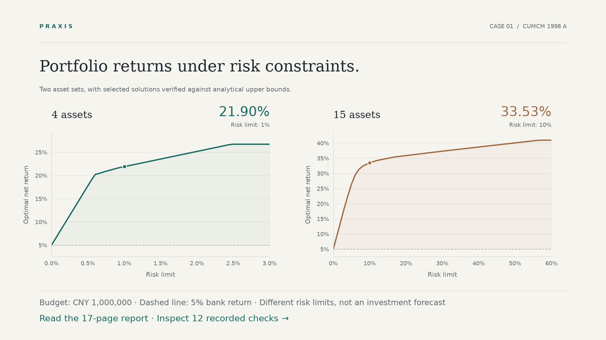
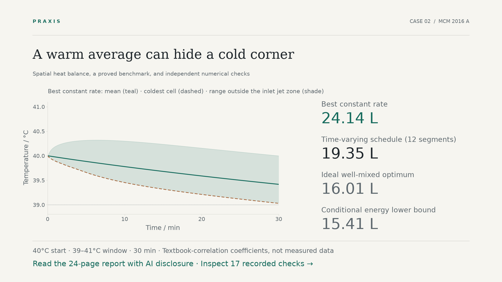

<div align="center">

# Praxis

### A modeling workflow your agent can put to work.

Build a model, challenge its conclusions, and deliver the evidence.

[](CHANGELOG.md)
[](https://agent-plugins.org/specification)
[](pyproject.toml)
[](templates/)
[](LICENSE)

[简体中文](README.md) · **English**

[Modeling cases](#two-complete-cases-to-explore) · [Quick start](#quick-start) · [Skills](#skills) · [Tools](#math-tools) · [Compatibility](#agent-compatibility) · [Reliability](#reliability)

</div>

**Praxis is an agent plugin for mathematical modeling**: seven skills (one for whole problems, six for single kinds of request), a set of math tools your agent can call, and an evidence workflow behind them. Work from a question and data toward **a model, independent checks, and a finished report**, or use a focused capability to examine assumptions, validate a result, or improve a draft.

Use it in research, coursework, and competitions, or to study resource allocation, environmental questions, public services, and engineering decisions. Define the objective, constraints, and available data; establish an interpretable baseline before adding complexity. On an unfamiliar problem it looks for the mathematical structure first and compares several different routes on record; with no answer key it produces conclusions labelled by how sure they are, through conjectures, counterexample searches and high-precision checks. Connected records reduce bookkeeping, repeated computation, and handoff overhead, leaving more attention for the decisions that matter.

<table>
<tr>
<td width="33%"><strong>Get to a complete draft</strong><br>Establish a baseline, finish the report, then improve as time allows.</td>
<td width="33%"><strong>Make claims inspectable</strong><br>Keep each result connected to its checks and its place in the report.</td>
<td width="33%"><strong>Work with the team you have</strong><br>Plan responsibilities around skills, availability, and team size.</td>
</tr>
</table>

## Two complete cases to explore

The competition cases make the full workflow inspectable; they do not define the limits of Praxis. Follow an investment decision through discrete fee thresholds, or examine how spatial heat transport changes a water-saving strategy. Each case comes with a finished report and runnable evidence, organized as a complete submission package.

<table>
<tr>
<td width="50%" valign="top"><strong>CUMCM · Investment and risk</strong><br>1998 CUMCM A</td>
<td width="50%" valign="top"><strong>MCM · A Hot Bath</strong><br>2016 MCM A</td>
</tr>
<tr>
<td width="50%" valign="top"><a href="demos/cumcm-1998-a/README.en.md"></a></td>
<td width="50%" valign="top"><a href="demos/mcm-2016-a/README.en.md"></a></td>
</tr>
<tr>
<td valign="top"><strong>When do transaction fees change the best allocation?</strong><br>Model fee thresholds and risk constraints together, then check the solution through regime enumeration and analytical bounds.</td>
<td valign="top"><strong>Can a warm average hide cold water?</strong><br>Compare a proved well-mixed benchmark with a three-dimensional thermal network, testing replenishment and temperature uniformity.</td>
</tr>
<tr>
<td valign="top"><strong>19-page Chinese report · 12 model checks</strong><br>At a CNY 1,000,000 budget, net returns are 21.90% for four assets at a 1% risk cap and 33.53% for fifteen assets at a 10% cap, under the problem's inputs and stated risk definition.</td>
<td valign="top"><strong>24-page English report · 17 model checks</strong><br>Over the 30-minute baseline, the best constant rate adds 24.14 L and a 12-segment schedule 19.35 L (20% less), against a 16.01 L ideal optimum and a 15.41 L energy bound. Coefficients come from textbook correlations, with stated ranges.</td>
</tr>
<tr>
<td valign="top"><strong>Report PDF + supporting ZIP</strong><br>Modeling code and reproduction evidence are available on the case page.</td>
<td valign="top"><strong>One report PDF</strong><br>Includes a one-page user guide and AI disclosure, with reproduction sources and evidence available separately.</td>
</tr>
<tr>
<td valign="top"><a href="demos/cumcm-1998-a/README.en.md"><strong>Explore the CUMCM case →</strong></a><br><a href="demos/cumcm-1998-a/deliverables/paper.pdf">Read the report</a> · <a href="demos/cumcm-1998-a/reproduce/">Run the model</a></td>
<td valign="top"><a href="demos/mcm-2016-a/README.en.md"><strong>Explore the MCM case →</strong></a><br><a href="demos/mcm-2016-a/deliverables/7391856.pdf">Read the report</a> · <a href="demos/mcm-2016-a/reproduce/">Run the model</a></td>
</tr>
</table>

A small **research-mode case** shows what happens when there is no answer key: guess a pattern, hold terms out, hunt for counterexamples and prove it twice, in [domino tilings of a 3×2n board](demos/domino-research/README.en.md).

Explore either case or bring your own problem. **Star Praxis** if you would like to follow its development.

## Quick start

### 1. Get it and connect it

**As a plugin (skills plus math tools).** Clone the repository, export the plugin, and hand it to a host that reads the Agent Plugins format:

```bash
git clone https://github.com/WJSGZZ/praxis.git
cd praxis
uv run --locked python -m scripts.build_plugin --output ../praxis-plugin
```

The plugin carries the seven skills and a `praxis-tools` server (`mcp.json`; on first launch uv prepares the environment from the lock file). The output directory must not exist yet.

**Skills only.** Drop the repository into your host's skills directory (the destination must not exist). It has no MCP tools, but the same tools run from the command line:

```bash
git clone https://github.com/WJSGZZ/praxis.git ~/.agents/skills/praxis
```

Claude Code uses `~/.claude/skills/praxis`; other locations are under [Agent compatibility](#agent-compatibility). Enable one copy per host. This gives you the entry skill, which reads the focused skills by path.

### 2. Prepare the computing environment

Scripts and tools need **Python 3.12**, [uv](https://docs.astral.sh/uv/), and a host with local file and terminal access:

```bash
uv sync --project /path/to/praxis --locked
```

The methodology works without Python.

### 3. Use Praxis in your project

Reload or start a new session, confirm that your host has loaded Praxis, and describe the work:

> Use Praxis to analyze this problem and its data, choose an appropriate approach, and work through implementation, independent validation, and the report.

Or start with a focused request:

> Review my model. Which assumptions lack support, and which conclusions still need validation?

> We have three team members. Organize tasks around our skills and available time, prioritizing a complete report.

**The skill directory stores reusable capabilities. Your workspace stores problems, data, cases, and reports.** Scripts handle execution and traceability; the agent handles interpretation, method selection, and scientific judgment.

## Skills

The entry skill takes a problem end to end; each focused skill handles one kind of request. If you only need one thing, call that skill instead of running the whole workflow.

| Skill | Ask it to | What it covers |
|---|---|---|
| [`praxis`](SKILL.md) | "Take this problem all the way" | The shared line of reasoning, the task record, team and deadline coordination, handoffs |
| [`praxis-model`](skills/praxis-model/SKILL.md) | "How should I model this? Where do the parameters come from?" | Problem definition, assumptions and parameter grounding, route and model choice, identifiability and optimization structure |
| [`praxis-compute`](skills/praxis-compute/SKILL.md) | "Run it and keep it reproducible" | CSV/Excel audit, preserved inputs, model and validator runs, stale-result detection, evidence links |
| [`praxis-verify`](skills/praxis-verify/SKILL.md) | "Can I trust this? Did I claim too much?" | Independent checks, bounds and optimality, sensitivity, strength of each claim |
| [`praxis-explore`](skills/praxis-explore/SKILL.md) | "What kind of problem is this?", "Is there another way?", "There is no answer key" | Structure discovery, route search and elimination, experimental mathematics, lessons that carry over; `route_graph` and structure probes |
| [`praxis-dialogue`](skills/praxis-dialogue/SKILL.md) | "Explain this model", "something feels off" | Plain-language explanation, review after results, and joint checking with inversion, pre-mortems and falsification |
| [`praxis-report`](skills/praxis-report/SKILL.md) | "Write it up, fix the abstract, check the PDF" | Paper structure, propositions and proofs, figures, reference checking against Crossref, AI disclosure, PDF checks and freezing |

All seven share the [methodology](references/methods.md) and one task record; see [capability handoffs](references/capabilities.md) for how work passes between them.


### Competitions are one application

Real-world and social questions, research, coursework, and competitions use the same modeling core. For a competition, verify the applicable edition and institutional rules, then configure team eligibility, report language, formats, attachments, AI disclosure, and deadlines.

For solo work under time pressure, Praxis defaults to one current user action and develops the report as results become available. Team tasks are assigned around skills and dependencies. Competition requirements are not applied to unrelated projects.

## Math tools

`praxis-tools` turns common methods into callable tools with JSON in and out. Hosts without MCP can run `python -m scripts.mcp_server --call <tool> '<json>'`. Every tool is tested against an answer derived separately: a textbook example, a closed form, or brute-force enumeration.

| Group | Tools |
|---|---|
| Programming and networks | `solve_lp` (dual-gap certificate), `solve_milp` (proved bound and gap), `solve_assignment`, `solve_tsp` (with a lower bound), `shortest_path`, `max_flow` (with the minimum cut), `minimum_spanning_tree` |
| Evaluation and weights | `ahp_weights` (consistency ratio), `entropy_weights`, `evaluate_alternatives` (TOPSIS with weight-stability) |
| Forecasting and dynamics | `backtest_baselines` (rolling-origin), `gm11_forecast`, `sir_simulate`, `sir_fit` (reports identifiability), `queue_mmc`, `equilibria` (equilibria and stability), `kalman_filter`, `solve_diffusion` (finite volumes with an energy account) |
| Decisions and risk | `markov_stationary`, `markov_absorption`, `matrix_game`, `eoq`, `newsvendor`, `cvar_portfolio` (minimum CVaR over scenarios), `pareto_front` |
| Structure and exploration | `probe_structure` (convexity, monotonicity, symmetry, power laws, invariants), `dimensional_analysis`, `check_total_unimodularity`, `route_graph` (route records), `test_conjecture`, `find_counterexample`, `guess_sequence`, `find_relation`, `lesson_add`, `lesson_search` |
| Uncertainty | `sobol_sensitivity` |
| Data and free literature | `audit_data`, `search_literature` (OpenAlex, with free full-text links), `find_open_access` (Unpaywall), `check_references` (DOI, title and year against Crossref) |

The plugin also wires in the open-source [arXiv server](https://github.com/blazickjp/arxiv-mcp-server) (Apache-2.0, pinned version) for preprint full text, LaTeX sections, and BibTeX export. For paywalled journal papers the tools find legal free copies; the rest can come from a school library.

When to use each method, what to check, and the usual misuse are in the [method and tool library](references/model-library.md). Python covers the ordinary uses of MATLAB and R.

## Agent compatibility

Use the same `SKILL.md`, references, and Python tools, with the discovery directory your host expects:

| Agent | Project directory | Local personal directory |
|---|---|---|
| Codex | `.agents/skills/praxis` | `~/.agents/skills/praxis` |
| Claude Code | `.claude/skills/praxis` | `~/.claude/skills/praxis` |
| Gemini CLI | `.agents/skills/praxis` or `.gemini/skills/praxis` | `~/.agents/skills/praxis` or `~/.gemini/skills/praxis` |
| GitHub Copilot | `.github/skills/praxis` or `.agents/skills/praxis` | CLI: `~/.copilot/skills/praxis` or `~/.agents/skills/praxis` |
| Cursor | `.agents/skills/praxis` or `.cursor/skills/praxis` | `~/.agents/skills/praxis` or `~/.cursor/skills/praxis` |

**Used in Codex today**; the other hosts are supported through their own documented formats and paths. Whether natural-language requests load the skill depends on the host.

Official sources, invocation differences, and required capabilities are documented in [Host compatibility](references/agent-compatibility.md).

## Command line and plugin layout

<details>
<summary><strong>CLI: initialize a case in a separate workspace</strong></summary>

These commands use POSIX shell syntax. Replace the paths with your actual locations:

```bash
BUNDLE="$HOME/.agents/skills/praxis"
WORKSPACE="/absolute/path/to/your/project"

"$BUNDLE/.venv/bin/python" "$BUNDLE/scripts/pipeline.py" \
  --workspace "$WORKSPACE" init \
  --name example \
  --problem "$WORKSPACE/problem.pdf" \
  --data "$WORKSPACE/data.csv"
```

The agent writes and reviews the case's `model.py` and `validate.py`, then executes `run`. Data, cases, and outputs are excluded from Git by default; project rules come from your workspace.

See the [Execution contract](references/automation.md) for the complete interface.

</details>

<details>
<summary><strong>Plugin layout</strong></summary>

The export follows [Agent Plugins 1.0](https://agent-plugins.org/specification) and includes both component types that version defines:

```text
praxis-plugin/
  plugin.json
  mcp.json                  # the praxis-tools server
  skills/
    praxis/                 # entry skill, with all references, scripts and tool code
    praxis-model/  praxis-compute/  praxis-verify/  praxis-explore/  praxis-dialogue/  praxis-report/
```

Your problems, data, and cases stay in your own workspace, never in the plugin.

</details>

## Reliability

- 63 automated tests cover analytical answers, input protection, failed and stale results, PDF helpers, the math tools, and plugin export.
- Both complete cases ship independent checks and runnable reproduction code; every number traces back to the report.
- Each conclusion states its basis and the conditions it holds under; failed runs are kept, not rewritten.

<details>
<summary><strong>Development and exercise commands</strong></summary>

```bash
uv sync --locked --group dev
uv run --locked python -m pytest -q
uv run --locked python -m examples.decision_sensitivity_demo
uv run --locked python -m examples.structural_reasoning_demo
uv run --locked python -m examples.exploration_demo
```


</details>

## Sources and licensing

Original code and documentation use the [MIT License](LICENSE). Workflow design references MathModelHub; Sobol analysis and TOPSIS use SALib and pyMCDM. See [Third-party notices](THIRD_PARTY_NOTICES.md) for reuse scope and upstream licenses. Cite methods, data, and tools where they are actually used in your report.

