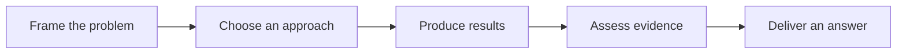

<div align="center">

# Praxis

### Give your AI agent a mathematical modeling workflow.

From problem framing to model validation and report delivery — one reusable toolkit.

[](https://agentskills.io/specification)
[](pyproject.toml)
[](LICENSE)

[简体中文](README.md) · **English**

[Quick start](#quick-start) · [Capabilities](#capabilities) · [Agent compatibility](#agent-compatibility) · [Validation and limitations](#validation-and-limitations)

</div>

---

Praxis helps individuals and teams turn problems and data into **interpretable models, independent checks, and traceable reports**. Use it for research, coursework, practical applications, or mathematical modeling competitions. Start with your problem; you do not need to choose an algorithm first.

A shared task record connects the entire workflow. Methods are selected as needed, validation is designed alongside the model, and verified results feed into the report. You can also use a single capability, such as reviewing assumptions or improving an argument.



<table>
<tr>
<td width="33%"><strong>Finish first</strong><br>Build a baseline and a complete draft, then improve within the remaining budget.</td>
<td width="33%"><strong>Keep evidence connected</strong><br>Link requirements, results, independent checks, and report locations.</td>
<td width="33%"><strong>Adapt to the team</strong><br>Assign ownership and handoffs around actual skills, team size, and availability.</td>
</tr>
</table>

## Quick start

### 1. Install the skill

For local agents that support the shared personal skills directory, clone into a destination that does not already exist:

```bash
git clone https://github.com/WJSGZZ/praxis.git ~/.agents/skills/praxis
```

For Claude Code, use `~/.claude/skills/praxis`. See [Agent compatibility](#agent-compatibility) for other locations. Enable only one copy per host; existing installations are not migrated automatically.

### 2. Prepare the computing environment

Running scripts requires **Python 3.12**, [uv](https://docs.astral.sh/uv/), and a host with local file and terminal access:

```bash
uv sync --project ~/.agents/skills/praxis --locked
```

You can use the methodological guidance without setting up Python. Adjust the skill path if you installed elsewhere.

### 3. Use Praxis in your project

Reload skills or start a new session, confirm that your host has loaded Praxis, and describe the work:

> Use Praxis to analyze this problem and its data, choose an appropriate approach, and work through implementation, independent validation, and the report.

Or start with a focused request:

> Review my model. Which assumptions lack support, and which conclusions still need validation?

> We have three team members. Organize tasks around our skills and available time, prioritizing a complete report.

**The skill directory stores reusable capabilities. Your workspace stores problems, data, cases, and reports.** Scripts handle execution and traceability; the agent handles interpretation, method selection, and scientific judgment.

This is the English project overview. The skill instructions and most detailed references are currently in Chinese; an English README does not imply a fully translated instruction set.

## Capabilities

| Capability | What it provides | Reference |
|---|---|---|
| Problem analysis | Requirements, variables, constraints, success criteria, and task dependencies | [Shared methodology](references/methods.md) |
| Models and mathematical reasoning | Baselines and necessary extensions; conditional guidance on dimensions, invariance, identifiability, and optimization structure | [Mathematical reasoning](references/mathematical-reasoning.md) |
| Data and computation | CSV/Excel audits, preserved inputs, reproducible runs, Sobol analysis, and TOPSIS evaluation | [Data and computation](references/data-computing.md) |
| Independent validation | Appropriate comparisons and checks, failed-run records, stale-evidence detection, and numerical task evidence links | [Execution contract](references/automation.md) |
| Visualization and writing | Figures, arguments, and reports grounded in valid results, with consistent numbers, units, and sources | [Visualization](references/visualization.md) · [Writing](references/writing.md) |
| Coordination and delivery | Starting strategies for one-, two-, and three-person teams; ownership, handoffs, fallback approaches, and delivery reserves | [Team adaptation](references/context-and-team.md) · [Solo delivery](references/solo-delivery.md) |

Capabilities follow the same reasoning workflow; you do not have to activate every capability for every request. See [Capability handoffs](references/capabilities.md) for shared inputs and outputs.

### Competitions are one application

CUMCM, MCM/ICM, coursework, and research share the modeling core. For a competition, verify the applicable edition and institutional rules, then configure team eligibility, report language, formats, attachments, AI disclosure, and deadlines.

For solo work under time pressure, Praxis defaults to one current user action and develops the report as results become available. Team tasks are assigned around skills and dependencies. Competition requirements are not applied to unrelated projects.

## Agent compatibility

Use the same `SKILL.md`, references, and Python tools, with the discovery directory your host expects:

| Agent | Project directory | Local personal directory |
|---|---|---|
| Codex | `.agents/skills/praxis` | `~/.agents/skills/praxis` |
| Claude Code | `.claude/skills/praxis` | `~/.claude/skills/praxis` |
| Gemini CLI | `.agents/skills/praxis` or `.gemini/skills/praxis` | `~/.agents/skills/praxis` or `~/.gemini/skills/praxis` |
| GitHub Copilot | `.github/skills/praxis` or `.agents/skills/praxis` | CLI: `~/.copilot/skills/praxis` or `~/.agents/skills/praxis` |
| Cursor | `.agents/skills/praxis` or `.cursor/skills/praxis` | `~/.agents/skills/praxis` or `~/.cursor/skills/praxis` |

**Compatibility evidence:** Codex collaboration and local Python execution have existing validation records. The official formats and discovery paths for all five hosts have been reviewed. The other four hosts, newly documented discovery paths, Windows, and remote environments still need actual testing. Natural-language invocation depends on the host.

Official sources, invocation differences, and required capabilities are documented in [Host compatibility](references/agent-compatibility.md).

## Tools and plugins

<details>
<summary><strong>CLI: initialize a case in a separate workspace</strong></summary>

These commands use POSIX shell syntax. Replace the paths with your actual locations:

```bash
BUNDLE="$HOME/.agents/skills/praxis"
WORKSPACE="/absolute/path/to/your/project"

"$BUNDLE/.venv/bin/python" "$BUNDLE/scripts/pipeline.py" \
  --workspace "$WORKSPACE" init \
  --name example \
  --problem "$WORKSPACE/problem.pdf" \
  --data "$WORKSPACE/data.csv"
```

The agent writes and reviews the case's `model.py` and `validate.py` before executing `run`. The CLI does not interpret arbitrary problems or generate models by itself. Data, cases, and outputs are excluded from Git by default; project rules come from your workspace.

See the [Execution contract](references/automation.md) for the complete interface.

</details>

<details>
<summary><strong>Plugin: export from the same maintained source</strong></summary>

Run from the repository root. The output directory must not already exist:

```bash
uv run --locked python -m scripts.build_plugin --output outputs/praxis-plugin
```

The export includes the skill, scripts, references, locked dependencies, both README versions, and license notices. Set up the environment explicitly and keep user materials in the workspace.

The skill is the cross-host entry point. The current plugin export follows OpenAI's plugin format, which does not imply universal plugin installation across hosts. Directory export is implemented; host installation and discovery remain unverified, and the plugin has not been published to the official directory.

See [Architecture](ARCHITECTURE.md) for the layout and conditions for future extensions.

</details>

## Validation and limitations

| Status | Current evidence |
|---|---|
| **Validated** | 39 local tool tests have previously passed, covering analytical answers, input protection, failed and stale evidence, PDF helpers, and self-contained plugin export; synthetic modeling exercises are also recorded |
| **Implemented guidance; field testing pending** | Context and team adaptation, solo deadline coordination, capability handoffs, and writing guidance |
| **Not yet completed** | Full cases in other agent hosts, real team competition runs, a complete three-day exercise, and host plugin installation tests |

Passing automatic checks does not establish real-world model validity. Weight-scenario shares are not objective probabilities, and execution logs are not complete AI conversations. Review task coverage against the original problem; PDF formulas, figures, and layout still need visual inspection. Large files and unsupported formats are explicitly marked for deferred auditing.

Praxis does not guarantee autonomous completion of arbitrary problems, competition awards, or submission without review.

<details>
<summary><strong>Development and exercise commands</strong></summary>

```bash
uv sync --locked --group dev
uv run --locked python -m pytest -q
uv run --locked python -m examples.decision_sensitivity_demo
uv run --locked python -m examples.structural_reasoning_demo
```

Code test records are distinguished from cross-host and real-task behavioral validation.

</details>

## Sources and licensing

Original code and documentation use the [MIT License](LICENSE). Workflow design references MathModelHub; Sobol analysis and TOPSIS use SALib and pyMCDM. See [Third-party notices](THIRD_PARTY_NOTICES.md) and [Review records](references/upstream-review.md) for reuse scope, upstream licenses, and selection decisions. Cite methods, data, and tools where they are actually used in your report.

<details>
<summary><strong>Commercial use and services</strong></summary>

MIT permits commercial use and selling copies, provided copyright and permission notices are retained. Dependencies and third-party materials remain subject to their own licenses; see the [MIT text](https://opensource.org/license/mit). Others may lawfully obtain and reuse this public repository.

Potential paid services include installation, original teaching materials, pre-competition or non-competition exercises, maintenance, and usage support. Define concrete deliverables rather than presenting a public URL as exclusive source-code access. No paid product, pricing, or validated service outcomes currently exist.

</details>
