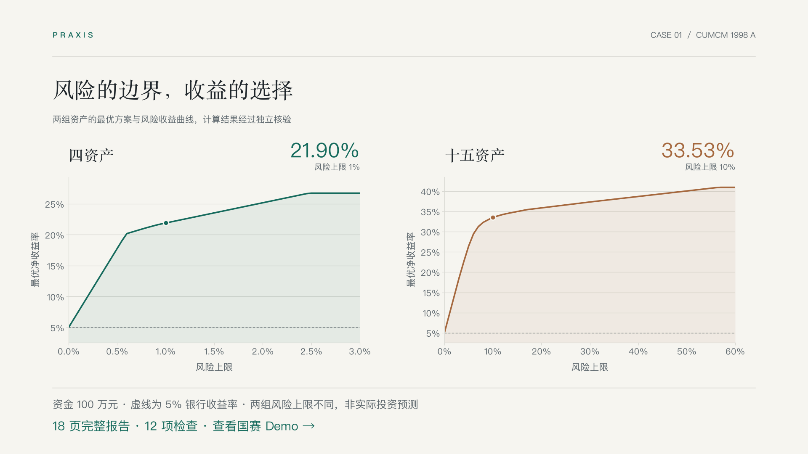
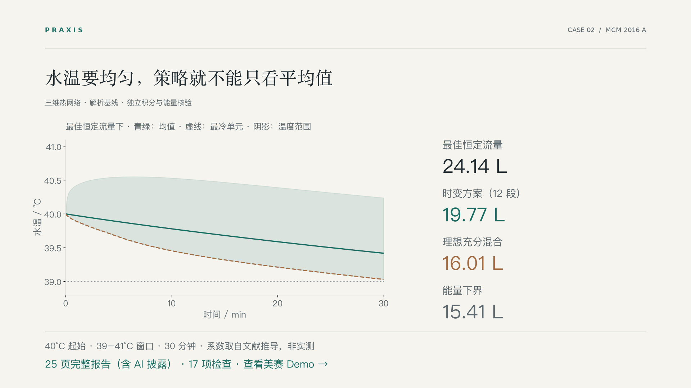

<div align="center">

# Praxis

### 让 AI Agent 成为你的数学建模伙伴。

读懂题目，建好模型，把结果写成一份有依据的报告。

[](CHANGELOG.md)
[](https://agent-plugins.org/specification)
[](pyproject.toml)
[](templates/)
[](LICENSE)

**简体中文** · [English](README.en.md)

[数学建模案例](#两个完整案例两种建模问题) · [快速开始](#快速开始) · [技能](#技能一览) · [工具](#数学工具) · [兼容](#agent-兼容) · [可靠性](#可靠性)

</div>

**Praxis 是面向通用数学建模的 Agent 插件**：六个技能（一个负责整题，五个各管一类请求）加一组可直接调用的数学工具，并带着证据工作流。它帮助个人或团队从问题和数据出发，完成**模型、核验和报告**；也可以只用于分析问题、审查模型、验证结果或改进论文。

研究、课程、比赛，以及资源分配、环境分析、公共服务和工程决策等现实问题，都可以使用这套工作方式。先明确目标、约束与数据，再建立可解释的基线，按需要增加复杂度；让需求、计算、验证和报告中的结论彼此对应，减少整理、重复计算与协作交接的负担，把精力留给关键判断。

<table>
<tr>
<td width="33%"><strong>完成优先</strong><br>先形成基线和完整稿，再按剩余预算改善。</td>
<td width="33%"><strong>证据贯穿</strong><br>任务、结果、独立检查和论文位置相互对应。</td>
<td width="33%"><strong>按团队适配</strong><br>根据实际人数、能力和可用时间安排责任与交接。</td>
</tr>
</table>

## 两个完整案例，两种建模问题

国赛与美赛是展示完整流程的两个 Demo，代表不同的问题类型，项目能力不以这两项赛事为边界。两份案例都按完整交付标准组织：从题目分析、模型与验证，到论文和复现材料；你可以从更感兴趣的问题进入。

<table>
<tr>
<td width="50%" valign="top"><strong>国赛 · 投资的收益和风险</strong><br>1998 CUMCM A</td>
<td width="50%" valign="top"><strong>美赛 · A Hot Bath</strong><br>2016 MCM A</td>
</tr>
<tr>
<td width="50%" valign="top"><a href="demos/cumcm-1998-a/README.md"></a></td>
<td width="50%" valign="top"><a href="demos/mcm-2016-a/README.md"></a></td>
</tr>
<tr>
<td valign="top"><strong>费用门槛怎样改变最优投资？</strong><br>分段费用与风险约束进入同一个模型，通过费用分区穷举和解析上界核验方案。</td>
<td valign="top"><strong>平均水温够高，远处的水也够暖吗？</strong><br>从可证明的完混基线进入三维热网络，比较补水策略、空间温差与能量下界。</td>
</tr>
<tr>
<td valign="top"><strong>17 页中文报告 · 12 项模型检查</strong><br>资金 100 万元时，四资产风险上限 1% 下的净收益率为 21.90%；十五资产风险上限 10% 下为 33.53%。</td>
<td valign="top"><strong>23 页英文报告 · 17 项模型检查</strong><br>30 分钟基准情景中，最佳恒定流量补水 24.14 L，分段方案 19.77 L（少 18%），理想完混 16.01 L，能量下界 15.41 L。系数取自文献推导，并给出取值范围。</td>
</tr>
<tr>
<td valign="top"><strong>论文 PDF + 支撑材料 ZIP</strong><br>完整代码与复现证据在案例页开放。</td>
<td valign="top"><strong>一份论文 PDF</strong><br>复现代码与证据单独开放，论文内附一页使用者说明及 AI 披露。</td>
</tr>
<tr>
<td valign="top"><a href="demos/cumcm-1998-a/README.md"><strong>查看完整国赛 Demo →</strong></a><br><a href="demos/cumcm-1998-a/deliverables/paper.pdf">阅读论文</a> · <a href="demos/cumcm-1998-a/reproduce/">复现计算</a></td>
<td valign="top"><a href="demos/mcm-2016-a/README.md"><strong>查看完整美赛 Demo →</strong></a><br><a href="demos/mcm-2016-a/deliverables/7391856.pdf">阅读论文</a> · <a href="demos/mcm-2016-a/reproduce/">复现计算</a></td>
</tr>
</table>

如果你也希望把建模推进到一份可核查的完整作品，欢迎 **Star Praxis**，或先用下面的方式试一次。

## 快速开始

### 1. 获取并接入

**作为插件使用（技能加数学工具）。** 克隆仓库后导出插件包，交给支持 Agent Plugins 格式的宿主安装：

```bash
git clone https://github.com/WJSGZZ/praxis.git
cd praxis
uv run --locked python -m scripts.build_plugin --output ../praxis-plugin
```

插件包含六个技能和 `praxis-tools` 工具服务（`mcp.json`；首次启动时 uv 按锁文件准备环境）。输出目录须尚不存在。

**只用技能。** 把仓库放进宿主的技能目录即可（目标目录须尚不存在），不含 MCP 工具，需要时用命令行调用同样的工具：

```bash
git clone https://github.com/WJSGZZ/praxis.git ~/.agents/skills/praxis
```

Claude Code 使用 `~/.claude/skills/praxis`，其他位置见 [Agent 兼容](#agent-兼容)。同一宿主只启用一个同名版本。这样得到入口技能，专项技能由它按路径读取。

### 2. 准备计算环境

脚本和工具需要 **Python 3.12**、[uv](https://docs.astral.sh/uv/) 和宿主的本地文件／终端能力：

```bash
uv sync --project /path/to/praxis --locked
```

仅使用分析方法时无需准备环境。

### 3. 在你的项目中使用

重载或重新开始会话，确认宿主加载了 Praxis，然后提出任务：

> 使用 Praxis 分析这道题和这些数据，选择合适的路线，推进模型实现、独立验证与报告。

也可以从一个明确的小任务开始：

> 审查我的模型：哪些假设没有依据，哪些结论还缺验证？

> 我们有三个人，请根据成员能力和可用时间安排任务，先完成一份完整报告。

**技能目录保存可复用能力，你的工作区保存题目、数据、案例和论文。** 程序负责执行与追溯，助手负责题意、选择和科学判断。

## 技能一览

一个入口负责整题，五个专项各管一类请求。只想做一件事时，直接调用对应技能，不必走完整流程。

| 技能 | 适合的请求 | 内容 |
|---|---|---|
| [`praxis`](SKILL.md) | “把这道题做完” | 统一主线、任务记录、团队与限时协调、环节交接 |
| [`praxis-model`](skills/praxis-model/SKILL.md) | “这题怎么做？参数怎么定？” | 读题与定义、假设和参数依据、路线与模型选择、可辨识性与优化结构 |
| [`praxis-compute`](skills/praxis-compute/SKILL.md) | “跑一下，保存可复现的结果” | CSV／Excel 审计、原件保全、模型与验证器执行、过期检测、证据索引 |
| [`praxis-verify`](skills/praxis-verify/SKILL.md) | “结果可信吗？结论说过头了吗？” | 独立检查、界与最优性、敏感性、证据与结论强度审查 |
| [`praxis-dialogue`](skills/praxis-dialogue/SKILL.md) | “给我讲讲这个模型”“我觉得哪里不对” | 用日常语言讲模型，结果出来后复盘，用逆向、事前验尸、证伪等方法共同检验 |
| [`praxis-report`](skills/praxis-report/SKILL.md) | “写论文、改摘要、查 PDF” | 论文结构、命题与证明、图表、参考文献核对、AI 披露、PDF 检查与冻结 |

六个技能共用 [统一方法](references/methods.md) 和同一份任务记录；能力之间的交接见 [能力分工](references/capabilities.md)。

### 比赛是一个使用场景

社会与现实问题、研究、课程和比赛共用建模核心。参赛时，再分别核验该届赛事与学校／赛区要求，配置人数、交付语言、格式、附件、AI 披露和截止时间。

单人限时任务默认只给用户一个当前事项，边取得结果边写报告；多人任务按能力和依赖安排主责与复核。通用项目不套用赛事规则。

## 数学工具

`praxis-tools` 把常用方法做成可直接调用的计算工具，输入输出都是 JSON；没有 MCP 的宿主可用 `python -m scripts.mcp_server --call 工具名 '参数'`。每个工具都有独立答案的测试：教科书例题、闭式解或暴力枚举。

| 类别 | 工具 |
|---|---|
| 规划与网络 | `solve_lp`（对偶间隙证书）、`solve_milp`（证明界与间隙）、`solve_assignment`、`solve_tsp`（附下界）、`shortest_path`、`max_flow`（附最小割）、`minimum_spanning_tree` |
| 评价与权重 | `ahp_weights`（一致性比）、`entropy_weights`、`evaluate_alternatives`（TOPSIS 与权重稳定性） |
| 预测与动态 | `backtest_baselines`（滚动起点基线）、`gm11_forecast`、`sir_simulate`、`sir_fit`（报可辨识性）、`queue_mmc` |
| 不确定性 | `sobol_sensitivity` |
| 数据与文献（均免费） | `audit_data`、`search_literature`（OpenAlex，附免费全文链接）、`find_open_access`（Unpaywall）、`check_references`（对照 Crossref 核对 DOI、题名与年份） |

插件还接入开源的 [arXiv 服务](https://github.com/blazickjp/arxiv-mcp-server)（Apache-2.0，固定版本），可读预印本全文和 LaTeX 分节、导出 BibTeX。付费期刊论文由工具找合法的免费版本，其余可通过学校图书馆或知网获取。

每种方法什么时候用、必须做哪些检查、常见误用，见 [方法与工具库](references/model-library.md)。常规的 MATLAB 与 R 用法，Python 基本都能覆盖。

## Agent 兼容

只用技能时，同一份 `SKILL.md`、参考与 Python 工具按宿主选择发现目录：

| Agent | 项目内目录 | 本地个人目录 |
|---|---|---|
| Codex | `.agents/skills/praxis` | `~/.agents/skills/praxis` |
| Claude Code | `.claude/skills/praxis` | `~/.claude/skills/praxis` |
| Gemini CLI | `.agents/skills/praxis` 或 `.gemini/skills/praxis` | `~/.agents/skills/praxis` 或 `~/.gemini/skills/praxis` |
| GitHub Copilot | `.github/skills/praxis` 或 `.agents/skills/praxis` | CLI：`~/.copilot/skills/praxis` 或 `~/.agents/skills/praxis` |
| Cursor | `.agents/skills/praxis` 或 `.cursor/skills/praxis` | `~/.agents/skills/praxis` 或 `~/.cursor/skills/praxis` |

**已在 Codex 中使用**；其余宿主按各自官方格式与路径提供。自然语言调用是否加载技能，取决于宿主。

官方依据、专用调用方式和能力条件见 [跨 Agent 兼容说明](references/agent-compatibility.md)。

## 命令行与插件结构

<details>
<summary><strong>命令行：在独立工作区建立案例</strong></summary>

以下命令以 POSIX shell 为例，路径需替换为实际位置：

```bash
BUNDLE="$HOME/.agents/skills/praxis"
WORKSPACE="/absolute/path/to/your/project"

"$BUNDLE/.venv/bin/python" "$BUNDLE/scripts/pipeline.py" \
  --workspace "$WORKSPACE" init \
  --name example \
  --problem "$WORKSPACE/problem.pdf" \
  --data "$WORKSPACE/data.csv"
```

助手在案例中写好并审核 `model.py` 和 `validate.py`，再执行 `run`。数据、案例与输出默认不进入 Git，项目规则由工作区提供。

完整接口见 [执行契约](references/automation.md)。

</details>

<details>
<summary><strong>插件包的结构</strong></summary>

导出目录按 [Agent Plugins 1.0](https://agent-plugins.org/specification) 组织，这一版规范包含的两类组件都有：

```text
praxis-plugin/
  plugin.json
  mcp.json                  # praxis-tools 工具服务
  skills/
    praxis/                 # 入口技能，带全部参考、脚本与工具代码
    praxis-model/  praxis-compute/  praxis-verify/  praxis-dialogue/  praxis-report/
```

用户的题目、数据与案例继续保存在你的工作区，不进入插件。

</details>

## 可靠性

- 63 项自动测试，覆盖解析答案、输入保护、失败与过期结果、PDF 辅助、数学工具与插件导出。
- 两份完整案例都带独立检查与可运行的复现代码，数字可对回报告。
- 每个结论标明依据与适用条件；失败的运行保留，不改写。

<details>
<summary><strong>开发与演练命令</strong></summary>

```bash
uv sync --locked --group dev
uv run --locked python -m pytest -q
uv run --locked python -m examples.decision_sensitivity_demo
uv run --locked python -m examples.structural_reasoning_demo
```


</details>

## 来源与许可

本地原创代码与文档采用 [MIT](LICENSE)。工作流参考 MathModelHub，Sobol 与 TOPSIS 分别使用 SALib 和 pyMCDM；实际复用范围与上游许可见 [第三方声明](THIRD_PARTY_NOTICES.md)。报告中实际使用的方法、数据与工具仍需在使用处引用原始来源。

