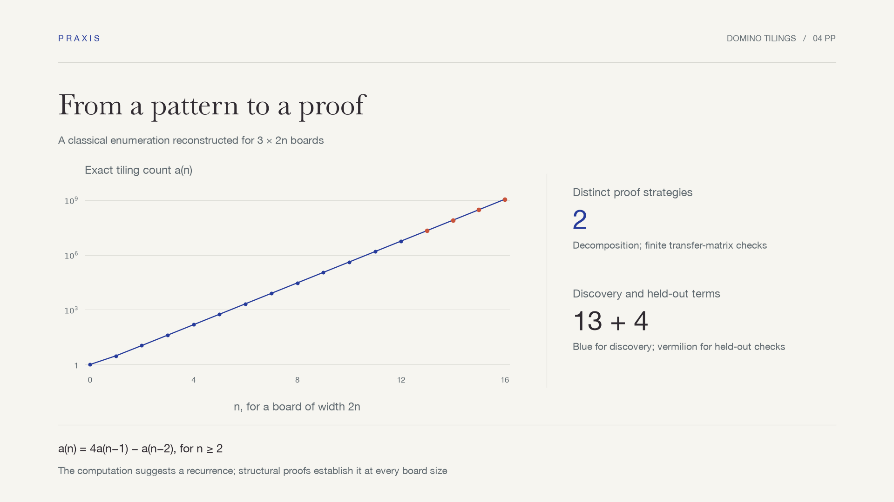

# Cases

### Follow the question through to the finished work

Contest reports, mathematical arguments, and decision studies—with the evidence behind them.

[简体中文](README.md) · **English** · [Back to Praxis](../README.en.md)

[Contest modeling](#contest-modeling) · [Mathematical research](#mathematical-research) · [Decision studies](#decision-studies)

## Contest modeling

Two complete demonstrations show different demands on a modeling workflow. Trace transaction fees through an investment decision, or see what a warm average conceals in a bath. Each case includes its report, runnable code, and checks, organized for its respective delivery target.

<table>
<tr>
<td width="50%" valign="top"></td>
<td width="50%" valign="top"></td>
</tr>
<tr>
<td valign="top"><strong>CUMCM · Investment and risk</strong> 1998 Problem A · 23-page Chinese report  Minimum fees make allocation decisions discontinuous. Regime enumeration and analytical bounds check the selected portfolio.  <a href="cumcm-1998-a/README.en.md">Explore →</a> · <a href="cumcm-1998-a/deliverables/paper.pdf">Report</a> · <a href="cumcm-1998-a/reproduce/">Reproduce</a></td>
<td valign="top"><strong>MCM · A Hot Bath</strong> 2016 Problem A · 25-page English report  A proved well-mixed benchmark meets a three-dimensional thermal network: local temperatures change the water-saving strategy.  <a href="mcm-2016-a/README.en.md">Explore →</a> · <a href="mcm-2016-a/deliverables/7391856.pdf">Report</a> · <a href="mcm-2016-a/reproduce/">Reproduce</a></td>
</tr>
</table>

## Mathematical research

Computation can suggest a pattern; a proof establishes where it holds. These notes cover two different tasks: reconstructing a classical result and obtaining a bounded conclusion inside an open problem.

<table>
<tr>
<td width="50%" valign="top"></td>
<td width="50%" valign="top"></td>
</tr>
<tr>
<td valign="top"><strong>Domino tilings · Discover, test, prove</strong> Combinatorial counting · 4-page English note  Compare three counting methods, test four held-out terms, then derive the recurrence through decomposition and a transfer-matrix argument.  <a href="domino-research/README.en.md">Explore →</a> · <a href="domino-research/deliverables/paper.pdf">Note</a> · <a href="domino-research/reproduce/">Reproduce</a></td>
<td valign="top"><strong>Collatz · A finite check with infinite reach</strong> Open-problem exploration · 7-page English note  A sharp first-crossing envelope reduces a conditional all-integer statement to exact finite checks. The same analysis exposes the route's limits.  <a href="collatz-research/README.en.md">Explore →</a> · <a href="collatz-research/deliverables/paper.pdf">Note</a> · <a href="collatz-research/reproduce/">Reproduce</a></td>
</tr>
</table>

## Decision studies

### Paying for the bottleneck

**2017 MCM B · Merge After Toll · 17-page English report**

Adding tollbooths can make waiting worse when downstream space is limited. This study connects payment compatibility, merging geometry and finite queues. Its fixed research archive retains the first draft, counterexamples, rejected routes and independent checks.

**[Open the research archive →](https://github.com/WJSGZZ/praxis/tree/main/research/merge-after-toll)**

---

Contest cases use historical problems, with complete deliverables on their own pages. Research notes state their proof scope and references, alongside reproducible evidence.
