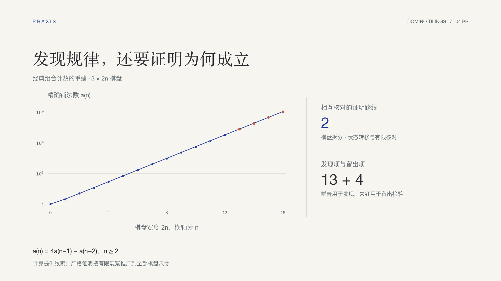

# 案例

### 看见问题怎样变成一份完整作品

从国赛、美赛的完整解答，到猜想、证明与开放数学探索。

**简体中文** · [English](README.en.md) · [返回 Praxis](../README.md)

[竞赛建模](#竞赛建模) · [数学研究](#数学研究) · [决策分析](#决策分析)

## 竞赛建模

从这两个完整 Demo 入手：一个处理费用门槛与风险，一个处理空间温差与控制。报告、代码和验证都可以打开查看；两个案例按各自的交付目标组织。

<table>
<tr>
<td width="50%" valign="top"></td>
<td width="50%" valign="top"></td>
</tr>
<tr>
<td valign="top"><strong>国赛 · 投资的收益和风险</strong> 1998 CUMCM A · 23 页中文报告  把最低交易费与风险约束放进一个优化模型，用费用分区和解析上界检查推荐方案。  <a href="cumcm-1998-a/README.md">查看案例 →</a> · <a href="cumcm-1998-a/deliverables/paper.pdf">论文</a> · <a href="cumcm-1998-a/reproduce/">复现</a></td>
<td valign="top"><strong>美赛 · A Hot Bath</strong> 2016 MCM A · 26 页英文报告  从理想完混基线走到三维热网络，解释为什么平均水温足够高，局部仍可能太冷。  <a href="mcm-2016-a/README.md">查看案例 →</a> · <a href="mcm-2016-a/deliverables/7391856.pdf">论文</a> · <a href="mcm-2016-a/reproduce/">复现</a></td>
</tr>
</table>

## 数学研究

没有标准答案时，计算负责发现线索，证明负责确定结论的范围。这两份笔记展示不同的研究任务：重建经典结果，以及在开放问题中建立有边界的结论。

<table>
<tr>
<td width="50%" valign="top"></td>
<td width="50%" valign="top"></td>
</tr>
<tr>
<td valign="top"><strong>多米诺 · 从规律到证明</strong> 组合计数 · 4 页英文笔记  三种算法核对小例子，保留四项检验猜测，再用构造分解与转移矩阵分别证明递推。  <a href="domino-research/README.md">查看案例 →</a> · <a href="domino-research/deliverables/paper.pdf">论文</a> · <a href="domino-research/reproduce/">复现</a></td>
<td valign="top"><strong>Collatz · 有限核对与严格归约</strong> 开放数学探索 · 7 页英文笔记  首收缩锐包络把无限整数域中的条件命题归约到有限检查，并证明继续扩大同类计算的局限。  <a href="collatz-research/README.md">查看案例 →</a> · <a href="collatz-research/deliverables/paper.pdf">论文</a> · <a href="collatz-research/reproduce/">复现</a></td>
</tr>
</table>

## 决策分析

### 收费之后，瓶颈在哪里？

**2017 MCM B · Merge After Toll · 17 页英文报告**

更多收费窗口不一定带来更短等待。研究把支付兼容、汇合几何与有限排队空间连接起来，保留首稿、反例、被拒绝的路线和独立核验。这是往年竞赛题上的条件性决策研究，作为固定研究归档展示。

**[打开研究归档 →](https://github.com/WJSGZZ/praxis/tree/main/research/merge-after-toll)**

---

竞赛案例采用往年题目，完整交付物见各自页面；研究笔记给出证明范围、文献来源与可复现依据。
