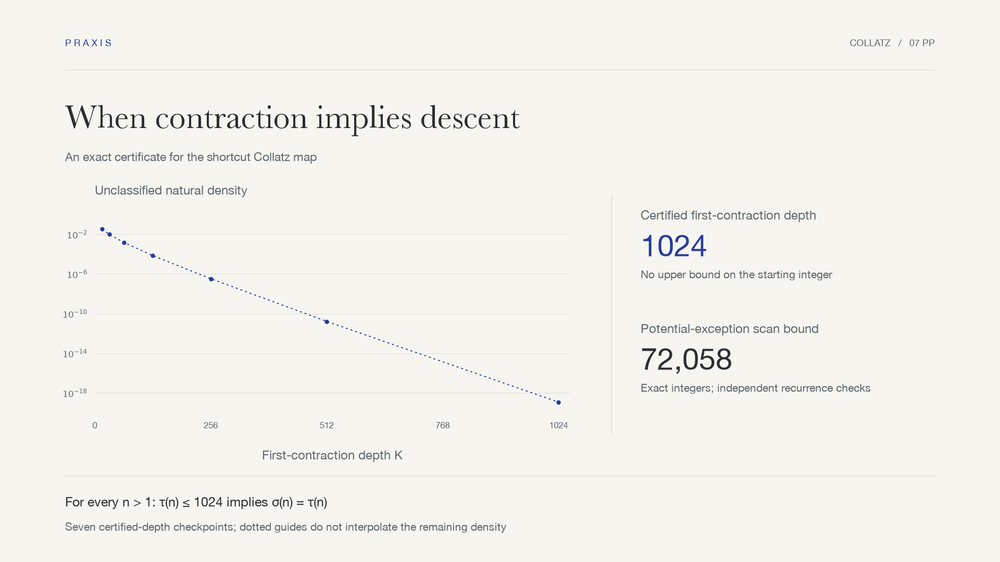

# Collatz: a finite check with infinite reach

**A sharp first-crossing envelope turns a conditional statement over all positive integers into a finite computation—and explains why this route cannot settle the general problem.**

[简体中文](README.md) · [Research note](deliverables/paper.pdf) · [Reproduction sources](reproduce/) · [All cases](../README.en.md)

[](deliverables/paper.pdf)

## The question

Use the shortcut Collatz map: halve an even integer; for an odd integer, multiply by three, add one, then halve. We ask when an iterate first falls below its starting value. These step counts differ from those of the unshortened map.

A parity prefix gives an affine expression: a coefficient times the start, plus a nonnegative offset. The first coefficient below one need not, by itself, force the endpoint below the start. Write τ for the first coefficient contraction and σ for the first actual descent. Can the constraints before that first contraction reduce an all-integer conditional claim to a manageable finite check?

## What the study establishes

| Result | Evidence and scope |
|---|---|
| **For every n>1, τ(n)≤1024 implies σ(n)=τ(n)** | A sharp offset envelope, a finite-reduction proof, and exact checks. There is no upper bound on n; larger or infinite τ is outside the theorem. |
| Only starts 2..72058 need checking for a potential failure | The worst envelope over 647 feasible first-crossing depths. All 72057 starts were checked, with no failure or trajectory censored at the cap. |
| Unclassified natural density is about 1.1537401×10^-19 | Forward state counts agree with a separate binomial recurrence. This is neither a divergence probability nor zero. |
| Normalized maximal offsets tend to 1/(6 ln 2) | An exact identity and classical equidistribution give the limit; no finite convergence rate is claimed. |
| Fixed horizons and one fixed envelope scan limit cannot cover the general case | Explicit uncovered starts and a proof that the sufficient scan bound grows without bound. Neither result supplies an actual counterexample or rules out other methods. |

## The argument

1. **Keep the first-crossing information.** Every earlier parity prefix must remain uncontracted, giving an exact integer barrier.
2. **Maximize under that barrier.** Each odd position has a latest feasible location. One word attains all those bounds, giving the unique sharp offset envelope.
3. **Reduce the possible exceptions.** A start whose endpoint has not descended must lie below the offset divided by the contraction gap. The largest required bound is 72,058.
4. **Check by different recurrences.** The generator follows the barrier word and forward counts. The checker instead uses max-plus extrema, binomial first-passage counts, and direct integer trajectories.
5. **Establish the stopping point.** Envelope asymptotics and explicit fixed-horizon obstructions identify the structural work that larger computations would leave undone.

## Checks behind the claims

The [verification summary](verification.json) binds the manuscript, PDF, code and recorded calculations. Six damaged certificates test wrong offsets, thresholds, missing crossing depths, densities, scan coverage and histograms; all are rejected.

A separate AI reviewer checked the six-page baseline and key numerical evidence, including independent extrema and trajectory calculations. The added example and both figure datasets were reviewed separately; the computational certificate is unchanged. That is distinct from human peer review or proof-assistant certification. The case is a literature-informed development study, with independently written scripts; it is not a blind evaluation or a causal estimate of the plugin's benefit.

## Inside the note

<table>
<tr>
<td width="50%"><a href="deliverables/paper.pdf"></a></td>
<td width="50%"><a href="deliverables/paper.pdf"></a></td>
</tr>
<tr><td><strong>The question and theorem</strong><br>The definitions keep coefficient contraction separate from actual descent.</td><td><strong>The barrier in a small example</strong><br>Inspect the parity word, offset and residue restriction directly.</td></tr>
</table>

**[Read the seven-page paper →](deliverables/paper.pdf)** Uses the shared [AMS-style research template](../../templates/research-paper.tex): amsart, 11pt Latin Modern, A4 and 30mm margins. Every page was visually inspected. Two figures explain the first-crossing construction and distinguish the scan bound from the remaining residue density.

## Research assessment

An author-external AI role read the current seven-page paper and performed bounded independent checks. **The work is a substantive computational synthesis; original mathematical contribution and major research significance remain unestablished.** The supplied arguments, method, exposition and inspectable evidence are supported within the stated review scope. The cited Rozier–Terracol Theorem 5.3 and Corollary 5.4 state stronger coverage, so depth 1024 is not a new verification record.

| Criterion | Finding |
|---|---|
| Correctness | The envelope, reduction and limitations have argument and bounded-check support; the full scan was not rerun in this review. |
| Originality | Unestablished; a theorem-level comparison with the closest literature is needed. |
| Significance | A self-contained certificate has methodological value, but a major new advance has not been demonstrated. |
| Method | Structural bounds reduce the problem to finite checks with distinct recurrences; transfer to other problems is untested. |
| Exposition | Conditional statements, density and uncovered cases are distinguished. |
| Verifiability | Exact certificates and source can be inspected; no proof-assistant certification is claimed. |

The priority is a bounded prior-art study, rather than a larger search. The [version-bound review](evaluation.json) retains evidence and limits. [Annals](https://annals.math.princeton.edu/board) and [Inventiones](https://link.springer.com/journal/222/aims-and-scope) provide the reference for importance and originality; this non-blind, uncalibrated AI assessment is neither journal endorsement nor an acceptance prediction.

## Reproduce it

Run from the repository root. Make a working copy first; `copytree` refuses an existing target:

```sh
uv run --locked python -c "from shutil import copytree; copytree('demos/collatz-research/reproduce', '.session/collatz-replay')"
uv run --locked python .session/collatz-replay/code/verify.py
uv run --locked python .session/collatz-replay/code/analyze.py
```

The core scripts use only the Python standard library. These commands recheck the certificate and regenerate presentation decimals in the copy. Run its `code/certify.py` to rebuild the certificate as well. Recorded generation and checking took about 0.065 and 0.639 seconds respectively; those observations exclude derivation, reading, review and typesetting.

## File map

```text
deliverables/paper.pdf          # complete English paper, seven pages
reproduce/paper/paper.tex       # corresponding manuscript source
reproduce/code/                # generator, independent checker, decimal analysis
reproduce/runs/                # fixed exact certificate and checking results
verification.json             # scope and evidence hashes
assets/                       # bilingual covers and actual page previews
```

## Background and license

Parity vectors, stopping times and offset comparisons have a classical literature; references appear in the note. This study extends the project's early replication with a sharp envelope, finite reduction and explicit route limitations. Original priority for those arguments has not been established. No resolution of the Collatz conjecture or computational record is claimed.

Original scripts, documentation and the note use the repository's [MIT License](../../LICENSE). Cited publications retain their own rights; their full texts are not redistributed.
