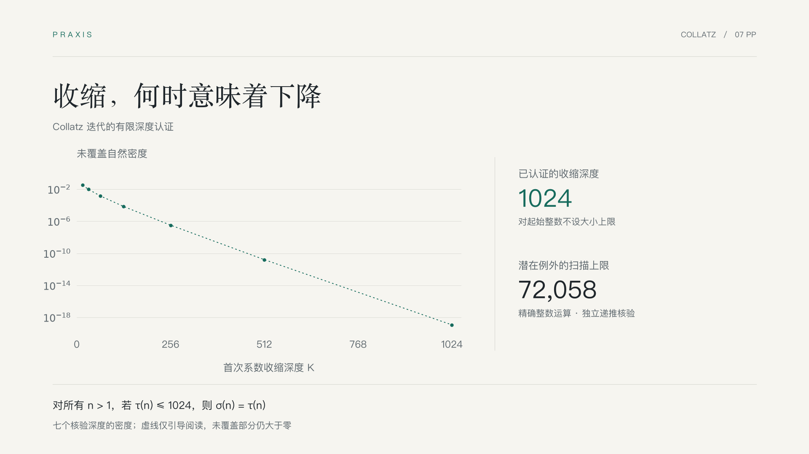
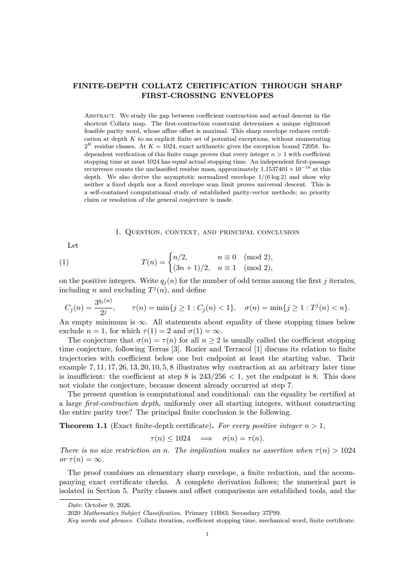
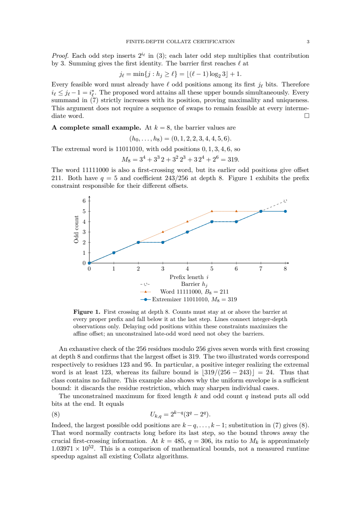

# Collatz：把有限核对连成严格结论

**开放数学研究怎样推进：找出首收缩结构，证明锐上界，把无限域条件命题归约到有限检查，再明确这条路线的局限。**

[English](README.en.md) · [论文 PDF](deliverables/paper.pdf) · [复现源码](reproduce/) · [案例总览](../README.md)

[](deliverables/paper.pdf)

## 这道题问什么

对正整数反复进行一个简单操作：偶数除二，奇数乘三加一再除二。我们研究它什么时候首次低于起点。这是快捷 Collatz 映射，步数与奇数步不除二的原映射不同。

把前缀迭代写成“系数 × 起点 + 偏移”。系数首次小于1，不自动保证实际数值也下降：正偏移可能抵消收缩。记首次系数收缩为τ，首次实际下降为σ。本研究问：能否利用“此前从未收缩”的信息，把一个覆盖无限整数的条件结论归约到可检查的有限计算？

## 先看结果

| 结论 | 证据与范围 |
|---|---|
| **对任意 n>1，若 τ(n)≤1024，则 σ(n)=τ(n)** | 锐偏移包络、有限归约证明与精确检查；起始整数没有大小上限，τ大于1024或无穷的情形不在结论中。 |
| 潜在失败只需检查2..72058 | 647个可行首次收缩深度取最坏界；72057个整数全检，无失败、无达到步数上限的未决项。 |
| 未覆盖自然密度约1.1537401×10^-19 | 压缩状态计数与独立二项递推一致；这是自然密度，不是发散概率，也不能当成零。 |
| 归一化最大偏移趋于1/(6 ln 2) | 由精确偏移恒等式和经典均匀分布准则证明，不给出未经证明的有限误差率。 |
| 固定步数与固定包络扫描界不能覆盖一般问题 | 明确构造未覆盖整数，并证明充分扫描界无界增长；不表示存在真正反例，也不排除其他方法。 |

## 怎样做

1. **保留第一次收缩的约束。** 每个此前的奇偶前缀都必须不收缩，形成精确的整数屏障。
2. **证明唯一锐包络。** 屏障约束每个奇数步最晚能出现在什么位置，最大偏移序列同时达到这些界。
3. **归约到有限例外。** 如果收缩时仍不下降，起点必须不超过偏移与收缩量之比。对所有可行深度取最大值，得到72058。
4. **用不同递推重新检查。** 生成端使用屏障序列与前向计数；检查端分别使用max-plus状态极值、二项首次到达递推和整数轨迹回放。
5. **证明什么时候应停。** 推导包络极限及无界增长，解释为什么单纯增加深度不能解决剩下的结构问题。

## 证据与验证

[公开核验摘要](verification.json)绑定源码、PDF和计算记录。六类坏证书测试覆盖错误偏移、错误阈值、遗漏收缩深度、错误密度、缩短扫描范围与错误直方图；均被检查器拒绝。

六页基线源码与关键数值由另一AI角色独立审读，另行重算深1024的极值与有限轨迹；本次新增算例与两图数据另经独立角色核对，计算证书未改。这不是人类同行评审或证明助手认证。此例是基于文献的开发研究，工具脚本独立编写，不作为插件因果收益或未见题盲测成绩。

## 翻两页论文

<table>
<tr>
<td width="50%"><a href="deliverables/paper.pdf"></a></td>
<td width="50%"><a href="deliverables/paper.pdf"></a></td>
</tr>
<tr><td><strong>问题与主结论</strong><br>区分系数收缩和实际下降，写清定理条件。</td><td><strong>屏障与算例</strong><br>用可逐项核对的小例子解释最大偏移构造。</td></tr>
</table>

**[阅读完整7页论文 →](deliverables/paper.pdf)** 采用共享 [AMS 研究模板](../../templates/research-paper.tex)，使用 amsart、11pt Latin Modern、A4 及 30mm 边距。七页已逐页查看；正文含屏障构造图与扫描界／密度对照图，图用于解释证明和计算结构。

## 研究评价

当前7页稿的作者外AI全文审读：**有实质推导和精确核验的综合计算笔记；原创性与重大研究重要性尚未建立。**证明、方法、表达及可核查性在列明范围内获支持。所引 Rozier–Terracol 的定理5.3及推论5.4已陈述更强覆盖，因此深度1024不能作为新的研究纪录。

| 方面 | 当前判断 |
|---|---|
| 正确性 | 所给结构界、归约及限制有推导与有界独立检查支持；本轮未重算完整扫描。 |
| 新颖性 | 未建立；需逐定理确认与最近文献的实质差别。 |
| 重要性 | 自包含证书有方法价值，尚无重大新进展的证据。 |
| 方法 | “结构界—有限例外—不同递推检查”明确；异题迁移未验证。 |
| 表达 | 条件命题、密度与未覆盖域区分清楚。 |
| 可核查性 | 源码及精确证书可检查；不等于证明助手认证。 |

最值得做的下一步是有边界的文献定位，而非继续扩大计算深度。[完整版本绑定评价](evaluation.json)保留六项证据、真实小检查和未核范围。以 [Annals](https://annals.math.princeton.edu/board)／[Inventiones](https://link.springer.com/journal/222/aims-and-scope) 的原创性与重要性要求作目标参照；本次非盲、未校准AI评议不认定顶刊水平，也不预测录用。

## 自己跑一次

在仓库根目录执行，先复制一份工作副本；目标已存在时`copytree`会拒绝覆盖：

```sh
uv run --locked python -c "from shutil import copytree; copytree('demos/collatz-research/reproduce', '.session/collatz-replay')"
uv run --locked python .session/collatz-replay/code/verify.py
uv run --locked python .session/collatz-replay/code/analyze.py
```

核心脚本只用Python标准库。上述命令在副本重新核验证书及生成展示小数，不覆盖归档；如需重建证书，再运行副本里的`code/certify.py`。记录中的生成与检查分别约0.065秒和0.639秒，不含阅读、推导、审稿和排版时间。

## 文件地图

```text
deliverables/paper.pdf          # 完整英文论文，7页
reproduce/paper/paper.tex       # 与交付PDF对应的LaTeX源码
reproduce/code/                # 证书生成、独立检查与展示数值
reproduce/runs/                # 固定的精确证书及核验结果
verification.json             # 证据范围与文件哈希
assets/                       # 中英文概览与真实页面预览
```

## 来源、边界与许可

奇偶向量、停止时间与偏移比较有经典文献基础，来源见论文参考文献。本例相对项目早期复现增加了锐包络、有限归约和路线局限；这些增量的文献原创性未认证，不声称解决Collatz猜想或创下验证规模纪录。

原创脚本、说明和论文按仓库[MIT许可](../../LICENSE)提供；引用文献的权利属于原权利人，没有随包复制文献全文。
