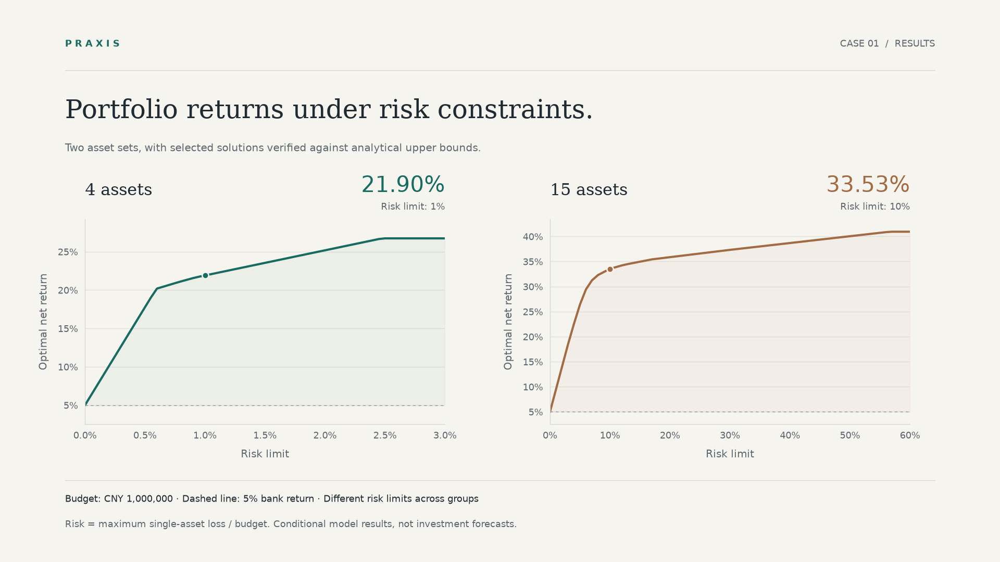

# CUMCM Demo: Investment Returns and Risk

**A classic problem, a complete report, and evidence you can run.**

This development case uses CUMCM 1998 Problem A to demonstrate problem framing, mixed-integer optimization, independent validation, and report delivery with Praxis. The full report is in Chinese.

[简体中文](README.md) · [Full report](deliverables/paper.pdf) · [Supporting ZIP](deliverables/supporting_materials.zip) · [Runnable source](reproduce/) · [Back to Praxis](../../README.en.md)



| Scenario | Risk limit | Optimal net return | Supporting evidence |
|---|---:|---:|---|
| 4 assets | 1% | **21.90%** | MILP, exhaustive fee-regime enumeration, analytical upper bound |
| 15 assets | 10% | **33.53%** | MILP and analytical upper bound |

The budget is CNY 1,000,000. Risk means the maximum single-asset loss amount divided by the budget; returns are net of transaction fees. The two rows use different risk limits and are not a direct comparison or a forecast of real investment returns.

## Why this case matters

- **Model the fee discontinuity.** No purchase incurs no fee; an active investment incurs a fee based on the larger of its principal and its fee threshold. The threshold is not a minimum purchase amount. Binary activation variables connect fees, bank deposits, and investments in one budget constraint.
- **Validate beyond the solver.** The four-asset check enumerates 81 fee regimes. A separate proportional-fee relaxation supplies an analytical upper bound for both groups. A feasible solution matching that bound establishes global optimality. The 12 recorded model checks include these comparisons and accounting, boundary, and scenario checks; they are not 12 independent algorithms.
- **Explain the budget dependence.** A sufficient capital threshold follows from the optimal allocation in the relaxed problem. At the representative risk limits, integer budgets of CNY 339 and CNY 2,602 respectively suffice. Four additional numerical checks verify the exact and rounded-up thresholds. This is a sufficient condition, not a necessary one.

- **Recommend without a stated preference.** Rescaling both axes to [0,1] and taking the point farthest above the chord gives a knee: 0.6% risk (20.19% return) for four assets, and 8% (32.29%, a flatter curve and weaker evidence) for fifteen. Both reach the analytical upper bound; the rule assumes a middle-of-the-road preference.
- **Following the plan without crossing the cap.** The knee portfolio uses the whole risk cap, so with ±5% error on each amount about 90% or more of random trials exceed it (median overshoot about 3–4%). Returns and chosen assets barely move (with ±10% error on every data field the same assets are chosen in over 99.5% of trials), so the margin to keep is on risk: tightening the cap by 5% costs only about 0.3–0.6 points of net return.
- **Are simple rules enough?** At CNY 1,000,000, greedy by return minus fee rate, buying each asset up to its risk allowance, matches the integer-programming optimum in all six cases tested: the minimum-fee thresholds are inactive, so the integer model earns its keep at small budgets. Ranking by return over risk loses up to 4.3 points, and equal weights reach only 11.8% and 22.0%. Reading risk as a standard deviation with independent returns, the same 0.6% and 8% caps give net returns of only 13.4% and 17.4%, and the stated max-loss knee portfolios carry several times the cap under that reading: confirm the risk definition first.

## Inside the report

<table>
<tr>
<td width="50%"><a href="deliverables/paper.pdf"></a></td>
<td width="50%"><a href="deliverables/paper.pdf"></a></td>
</tr>
<tr><td><strong>The answer</strong><br>Definitions, method, and quantitative results.</td><td><strong>The argument</strong><br>An upper bound, exchange proof, and sufficient capital condition.</td></tr>
</table>

[Read the complete 16-page report →](deliverables/paper.pdf)

## Reproduce it

From the repository root:

```bash
uv sync --locked
uv run --locked python demos/cumcm-1998-a/reproduce/run_demo.py
uv run --locked python demos/cumcm-1998-a/reproduce/check_capital_threshold.py
uv run --locked python demos/cumcm-1998-a/reproduce/check_recommendation.py
uv run --locked python demos/cumcm-1998-a/reproduce/check_robustness.py
uv run --locked python demos/cumcm-1998-a/reproduce/check_alternatives.py
```

The first script recalculates both groups, runs the model checks, and compares results with the report's reference records. The second runs the four supplementary capital-threshold checks, and the third locates the knee points and certifies them against the analytical bound. The fourth runs seeded random trials of execution and parameter error around the knee portfolios. The fifth compares them with simple rules, asset-by-asset removal and the alternative risk reading. Generated results go to `reproduce/reproduced/`, excluded from Git. The first script refuses to overwrite that directory; move existing results before rerunning.

Alternatively, extract the supporting ZIP and follow its instructions to reproduce the mathematics without Praxis or an AI service. The supplementary threshold script belongs to this development case and does not alter the report's support-file list.

`deliverables/` contains exactly two electronic submission files: the PDF with its full modeling-code appendix and the ZIP with 25 supporting files, including AI-use details. Previews, this case guide, runnable development sources, and file hashes remain outside that directory. The PDF was rendered and reviewed page by page; the ZIP was independently extracted and rerun, and its file list matches the appendix.

## Sources and scope

The parameter tables are transcribed from page 11 of the organizer's [official historical problem collection](https://www.mcm.edu.cn/upload_cn/node/1/SkAh1A7Q6f2dd01e58aa621f920e79f45cd5d255.pdf). The original collection is linked, not redistributed. The report layout follows the [2026 national formatting rules](https://www.mcm.edu.cn/html_cn/node/4cd596519c9eb9fbd866398f6df0caa3.html), with disclosure based on the [2026 AI-use rules](https://www.mcm.edu.cn/html_cn/node/fef94648f2836ab6cc81586f4c38512b.html).

The solution, implementation, figures, and report were created for this project. This is a development demonstration, not an official answer, an award-winning entry, or a real competition result. AI involvement and the recorded human-review status remain disclosed in the support package. The case validates this conditional optimization model and delivery workflow, not arbitrary autonomous problem solving or untested hosts.

Original project code, documentation, and figures use the repository's MIT license. Problem parameters retain their source attribution; third-party tools retain their own licenses.

If the complete case helps you, **star Praxis** or open an Issue with a concrete question and reproduction results.
