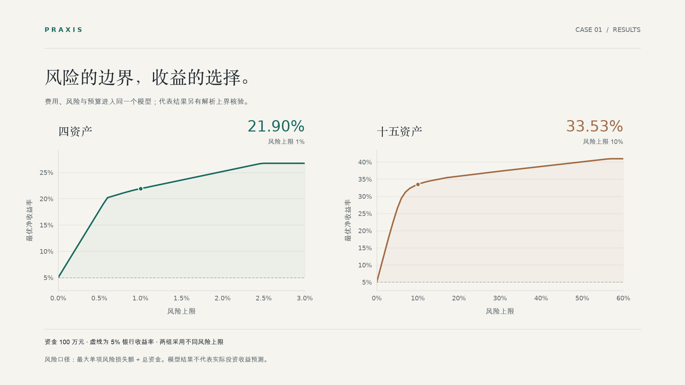
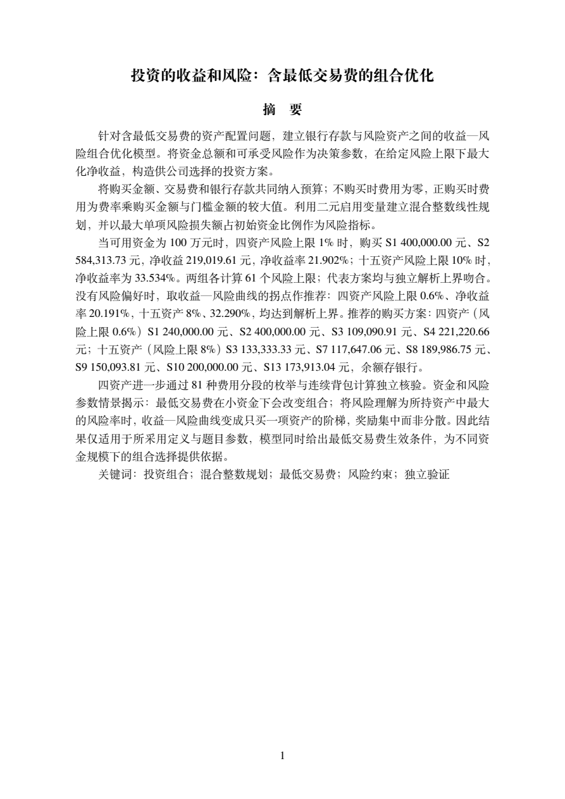
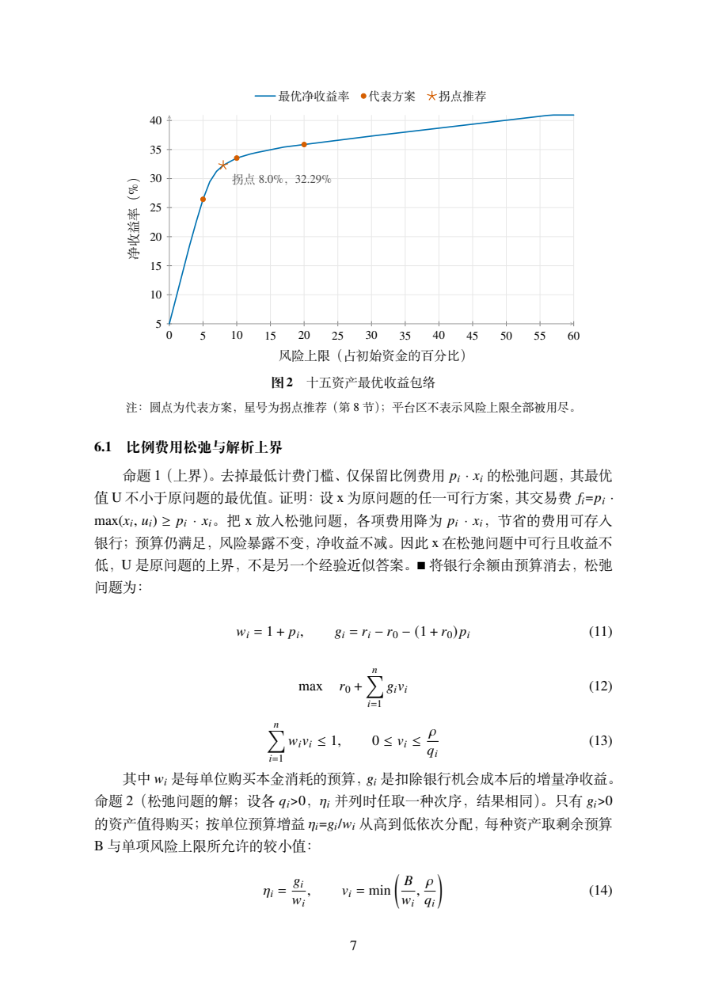

# 国赛 Demo：投资的收益和风险

**1998 CUMCM A：一道带最低交易费的组合优化，从建模、证明、稳健性到可核查的论文。**

[English](README.en.md) · [完整论文 PDF](deliverables/paper.pdf) · [支撑材料 ZIP](deliverables/supporting_materials.zip) · [复现代码](reproduce/) · [返回 Praxis](../../README.md)



## 这道题问什么

一家公司有一笔资金 M，可以买 n 种资产，也可以存银行（年利率 5%，无风险、无费用）。每种资产有平均收益率、风险损失率和交易费率；买入额不足某个门槛时，仍按门槛金额计费。总体风险用所买资产中风险损失额最大的一项衡量。题目给出一组 4 种资产和一组 15 种资产，要求设计投资组合，使净收益尽可能大、风险尽可能小。

难点不在计算量，而在三处：费用是分段函数、两个目标要折中、题目没有给出公司的风险偏好。

## 先看结果

| 场景 | 风险上限 | 最优净收益率 | 对应论证 |
|---|---:|---:|---|
| 4 种资产 | 1% | **21.90%** | MILP 求解、费用分区穷举、解析上界 |
| 15 种资产 | 10% | **33.53%** | MILP 求解、解析上界 |

总资金 **100 万元**，风险定义为“单项资产风险损失额的最大值 ÷ 总资金”，净收益已扣交易费。两行风险上限不同，不能用来比较两组资产的优劣，也不是实际投资收益预测。没有风险偏好时，推荐收益—风险曲线的拐点：4 种资产在风险上限 0.6%（净收益率 20.19%），15 种资产在 8%（32.29%）。

## 怎样解的

1. **整理题意。** 把不买时费用为零、买入后按投资额与门槛的较大者计费写成分段函数；银行余额、购买本金和手续费放进同一个预算约束。
2. **混合整数线性规划。** 用二元变量表示是否启用资产，在给定风险上限下最大化净收益，扫描风险上限得到收益—风险曲线。
3. **独立依据。** 去掉最低门槛得到比例费用的松弛问题，它的解析上界必然不低于原问题；可行方案达到上界就证明全局最优。4 种资产另用 81 种费用状态穷举核验。
4. **资金规模。** 推出充分条件：资金足够覆盖所有启用资产的门槛时，原问题达到松弛上界；代表风险上限下分别是 **339 元、2602 元**。它不是必要条件。
5. **推荐与稳健性。** 取曲线拐点作为无偏好时的推荐，再检验它能否被照着执行、数据有误差时是否还成立。

## 证据与验证

- **12 项模型检查**覆盖约束、费用、边界与参数情景，另有 4 项资金阈值核验、2 项拐点核验；这些是不同层面的检查，不是 12 套独立算法。
- **推荐方案用满了风险上限，所以照着做容易越界。** 每项投资额有 ±5% 的操作误差时，约九成的随机试验超出上限（中位数超出 2%–3%）；数据各项有 ±10% 误差时，所选资产在 99.5% 以上的试验里不变。因此要留的是风险余量：收紧 5%，净收益率只少约 0.3–0.6 个百分点。
- **简单规则能走多远。** 资金为 100 万元时，按论文命题 2 的单位预算增益从高到低、每项买到风险上限允许的最大额，与整数规划在六个检验情形里完全一致，说明最低门槛在大资金下不起作用，整数模型的价值在小资金；按“收益率除以风险率”排序最多差 4.3 个百分点，平均分配只有 11.8% 与 22.0%。
- **每个被选资产都不可替代。** 去掉任何一个，净收益率都明显下降。
- **风险的定义会改变答案。** 把风险率当作标准差、收益相互独立，同一上限下最优净收益率只有 13.4% 与 17.4%，而题设口径下的拐点方案在这种读法下风险高出数倍。论文按题设作答，把这一对照写成需要先与决策者确认的事项。

## 翻两页报告

<table>
<tr>
<td width="50%"><a href="deliverables/paper.pdf"></a></td>
<td width="50%"><a href="deliverables/paper.pdf"></a></td>
</tr>
<tr>
<td><strong>摘要：问题、方法、结果</strong><br>明确风险口径、费用处理与代表数值。</td>
<td><strong>论证：从计算到证明</strong><br>解析上界、交换论证与资金规模充分条件。</td>
</tr>
</table>

**[阅读完整 23 页论文 →](deliverables/paper.pdf)** 使用固定的 Tectonic 0.17.0 与 v33 资源包排版：中文用 ctex，西文与公式用 Times 系，图由 pgfplots 从数据直接绘制；一级标题居中，图题在图下、表题在表上。正文不含目录，附录列出支撑材料文件清单和完整源程序，符合 2026 年国赛格式规范；字体与字号官方不作统一要求。

论文采用固定的 Fandol 0.3 宋体／黑体，随 TeX Live、MiKTeX 或 Tectonic 提供，不依赖 macOS／Windows 系统字体。文件版本与哈希见[字体清单](../../templates/cumcm-fonts.json)；遇到缺失应安装该字体包，不能静默换字。数值复现不需要 LaTeX。

## 自己跑一次

在 Praxis 仓库根目录运行：

```bash
uv sync --locked
uv run --locked python demos/cumcm-1998-a/reproduce/run_demo.py             # 两组资产的方案、曲线与 12 项核验
uv run --locked python demos/cumcm-1998-a/reproduce/check_capital_threshold.py  # 资金阈值（4 项）
uv run --locked python demos/cumcm-1998-a/reproduce/check_recommendation.py     # 拐点与解析上界
uv run --locked python demos/cumcm-1998-a/reproduce/check_robustness.py         # 执行误差、安全余量、数据误差（种子固定）
uv run --locked python demos/cumcm-1998-a/reproduce/check_alternatives.py       # 简单规则、逐项剔除、另一种风险读法
```

整套约几分钟。结果写入 `reproduce/reproduced/`，不进入 Git；第一条命令不会覆盖已有结果目录。也可以只解压 [支撑 ZIP](deliverables/supporting_materials.zip)，按其中说明独立复现论文计算，不需要 Praxis，也不连接 AI 服务。

## 文件地图

```text
deliverables/                 # 两份电子提交文件
  paper.pdf                   # 23 页；含支撑清单与完整建模源程序
  supporting_materials.zip    # 26 文件；含 LaTeX 源文件与 AI工具使用详情.pdf
reproduce/                    # 复现入口、归档数值与检查脚本
assets/                       # 首页与案例页图片
manifest.json                 # 两份交付文件的字节数、MD5、SHA-256
verification.json             # 验收记录
```

提交目录只放 PDF 与 ZIP；预览、说明和哈希记录在外部。PDF 已逐页渲染审查，支撑包已独立解压重跑，附录清单与 ZIP 成员一致。

## 来源、边界与许可

- 题目与两张参数表来自组委会[官方历史赛题汇编](https://www.mcm.edu.cn/upload_cn/node/1/SkAh1A7Q6f2dd01e58aa621f920e79f45cd5d255.pdf)第 11 页；仅收录复现所需参数与来源记录，不附原题汇编全文。
- 论文与附件结构参考[2026 论文格式规范](https://www.mcm.edu.cn/html_cn/node/4cd596519c9eb9fbd866398f6df0caa3.html)，AI 声明依据[2026 AI 工具使用规定](https://www.mcm.edu.cn/html_cn/node/fef94648f2836ab6cc81586f4c38512b.html)。
- 解法、实现、图表和论文为本项目制作，不是官方答案、获奖论文或真实参赛成绩；AI 参与与人工核验记录如实保留在支撑包中。
- 本案例验证的是当前条件优化模型与交付链条，不代表任意题目都能自动完成。

实现、文档与图表遵循仓库 MIT 许可；题目参数注明来源，第三方工具保留各自许可。未收录正式赛事中的私有材料。

如果这个案例对你有帮助，欢迎 **Star Praxis**，也欢迎带着具体问题和复现结果提交 Issue。
