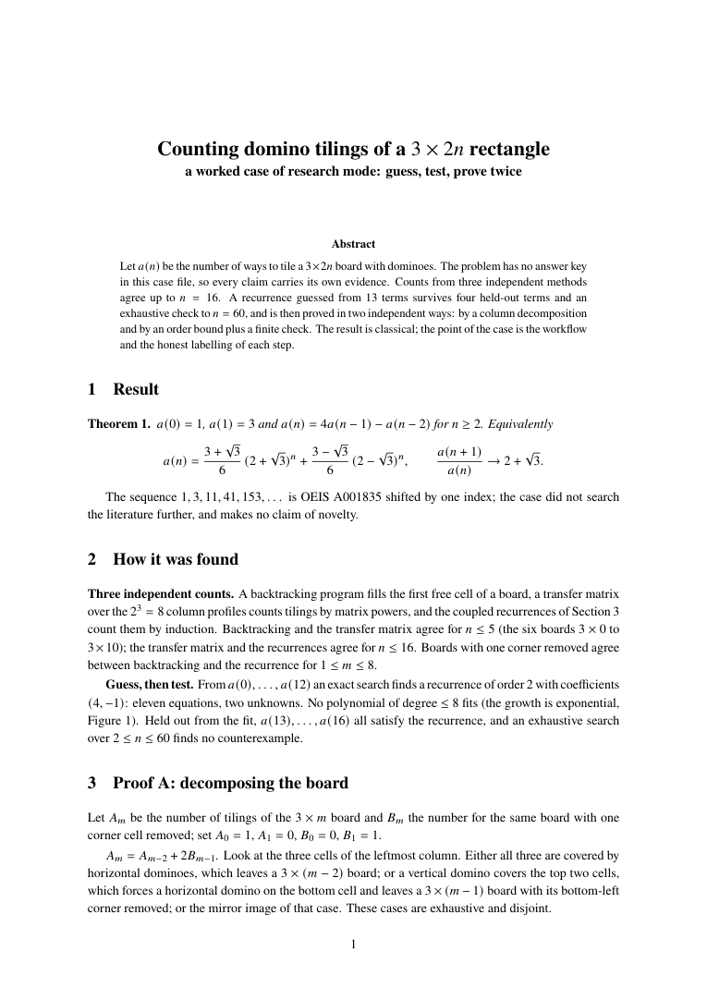
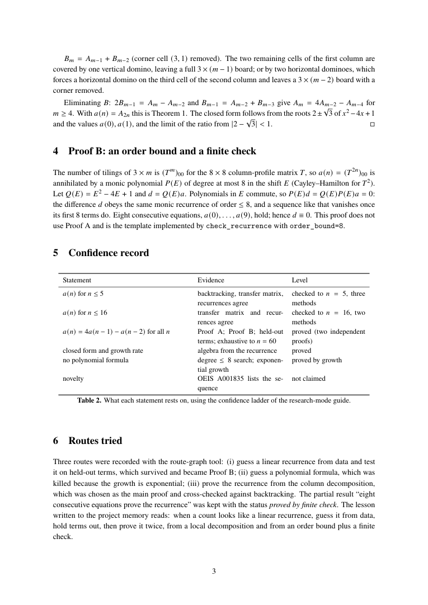

# Research-Mode Case: Domino Tilings of a 3×2n Board

**How Praxis works when no answer key exists: guess a pattern, hold terms out, hunt for counterexamples, prove it twice, and label how sure each claim is.**

[中文](README.md) · [Research note (PDF)](deliverables/note.pdf) · [Reproduction code](reproduce/) · [Back to Praxis](../../README.en.md)

## What the problem asks

In how many ways can a 3×2n rectangle be tiled with 1×2 dominoes? Call the count a(n). The problem comes with no answer key and no ready-made model: the pattern has to be found and then proved. It is a classical result, and the case does not claim a discovery; it shows how Praxis's research mode turns "looks right" into "proved".

## Results first

| Statement | Confidence | Evidence |
|---|---|---|
| a(n) = 4a(n−1) − a(n−2), a(0)=1, a(1)=3 | **Proved, twice and independently** | a decomposition by the leftmost column; an order bound from the transfer matrix plus a check of eight equations |
| a(n) = ((3+√3)/6)(2+√3)ⁿ + ((3−√3)/6)(2−√3)ⁿ, ratio → 2+√3 | Proved | follows from the recurrence |
| First 17 terms 1, 3, 11, 41, 153, … , 1117014753 | Checked to n=16 | backtracking, transfer matrix and recurrences agree (all three for n≤5, the last two to n=16) |
| No polynomial formula of degree ≤ 8 | Proved | the growth is exponential |

## How it is done

1. **Three independent counts of small cases:** backtracking, a transfer matrix over 8 column profiles, and coupled recurrences from a local decomposition, checked against each other.
2. **Guess:** an exact search on the first 13 terms finds a recurrence of order 2 with coefficients (4, −1), eleven equations for two unknowns; a polynomial formula is ruled out.
3. **Hold out and attack:** a(13)…a(16) were kept out of the fit and all satisfy the recurrence; an exhaustive search over 2≤n≤60 finds no counterexample.
4. **Prove it twice:** splitting by the leftmost column gives two coupled recurrences that eliminate to the result; independently, the transfer matrix bounds the order by N=8, so the difference sequence obeys the same order-8 recurrence and vanishes once its first 8 terms do.
5. **Record:** `route_graph` keeps the three routes (guess a recurrence, guess a polynomial, decompose by columns) and why one died; `route_to_lesson` drafts a lesson that can carry over.

## Evidence

- the three methods agree wherever they can be compared;
- the recurrence holds on four held-out terms and for n≤60, and is proved by two independent arguments;
- the finite-check proof rests on "order at most 8", which comes from the 8×8 transfer matrix (Cayley–Hamilton), not from the data;
- every claim carries a rung of the confidence ladder; a proof without machine verification is not called a theorem.

## Two pages of the note

<table>
<tr>
<td width="50%"><a href="deliverables/note.pdf"></a></td>
<td width="50%"><a href="deliverables/note.pdf"></a></td>
</tr>
<tr>
<td><strong>Result and discovery</strong><br>The theorem, three ways of counting, the guess and its hold-out test.</td>
<td><strong>Proof and confidence record</strong><br>The finite-check proof, the evidence level of each claim, the routes recorded.</td>
</tr>
</table>

**[Read the complete 4-page research note →](deliverables/note.pdf)** Typeset with XeLaTeX; the figure is drawn by pgfplots from the archived numbers.

## Run it yourself

From the Praxis repository root:

```bash
uv sync --locked
uv run --locked python demos/domino-research/reproduce/explore.py   # recomputes every number in seconds; writes reproduce/reproduced/
```

To retypeset the note you need XeLaTeX: `uv run --locked python demos/domino-research/reproduce/build_note.py`.

## File map

```text
deliverables/note.pdf         # the research note (English, 4 pages)
reproduce/explore.py          # three counts, guess and tests, finite check, route record and lesson
reproduce/build_note.py       # typesets the note from the archived numbers
reproduce/reference/          # archived numbers and the route record
assets/                       # images for this page
```

## Sources, limits and license

- The sequence 1, 1, 3, 11, 41, 153, … is [OEIS A001835](https://oeis.org/A001835) (offset by one); the case did not search the literature further and claims no novelty.
- The proofs in the note are short enough to check by hand; nothing was formalised in a proof assistant. The case shows a way of working, not an upper bound on research strength.
- Code, note and figure are under the repository's MIT license.

If this case helps you, a **Star on Praxis** is welcome, as are issues with a concrete question and a reproduction.
