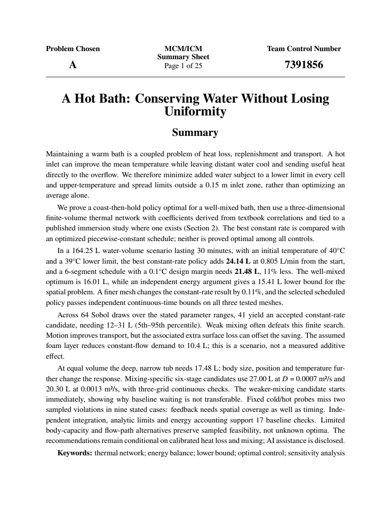
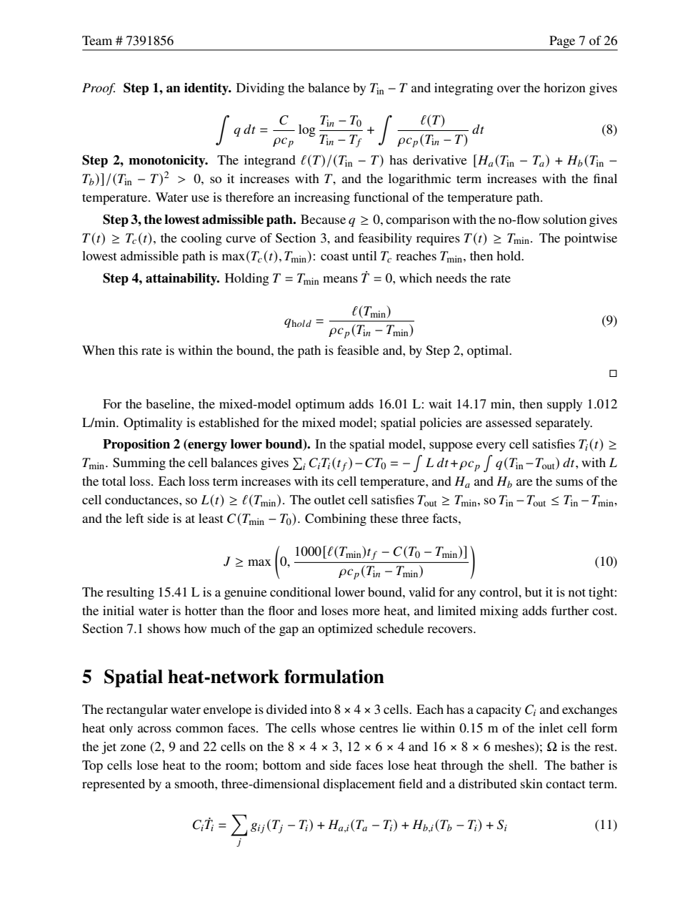

# MCM Demo: Keeping a Bath Warm With Less Water

**2016 MCM Problem A, "A Hot Bath": from mean water temperature to spatial differences, strategy comparison, and whether anyone can follow the answer.**

[中文](README.md) · [Full paper (PDF, English)](paper.pdf) · [Reproduction code](reproduce/) · [Back to Praxis](../../README.en.md) · [All cases](../README.en.md)

[](paper.pdf)

## What the problem asks

Someone lies in a full tub of hot water and the water slowly cools. How should hot water be added so that the temperature stays near its starting value while using as little water as possible? The statement also asks about the tub's shape and size, the bather's size and movement, and a bubble-bath layer, and wants a plain-language note for the user.

The difficulty is that no temperature data are given. Heat-loss coefficients, body heat uptake and mixing all need evidence from standard correlations and published experiments, and "temperature" cannot mean only the mean, because water far from the tap can be colder.

## Results first

| Same 30-minute scenario | Added water | What it supports |
|---|---:|---|
| 3-D thermal network, best constant rate | **24.14 L** | The least water among accepted candidates; not a global optimum over all controls |
| 3-D thermal network, buffered six-stage schedule | **21.48 L** | A 0.1°C design margin; independent integration and continuous-time bounds pass on three meshes, using about 11% less water than constant flow |
| Perfectly mixed model | **16.01 L** | A proved optimum ("coast, then hold") for that ideal model |
| Energy-conservation bound | **15.41 L** | A conditional lower bound for any feasible strategy under the stated heat-loss assumptions |

Volume 164.25 L, start 40°C, limits 39–41°C, largest spatial spread 1.5°C (the ceiling and spread apply outside a 0.15 m jet zone around the inlet; the floor holds in every cell). Surface loss comes from textbook natural-convection, radiation and evaporation correlations (about 35.4 W/(m² K) for open water, 25 after the bather's cover); body exchange is anchored in the core-temperature rise of an [immersion study](https://doi.org/10.1113/EP092761); mixing has no anchor and stays a scenario. No tub experiment exists, so the numbers demonstrate a method and are not a use or safety standard.

**The water needed depends strongly on the loss coefficients; whether the search accepts a policy depends mainly on mixing.** Across 64 Sobol draws over the scenario ranges, 41 had an accepted constant-rate policy, needing 12–31 L (5th–95th percentile, median 22 L); the rest had none, mostly because of weak mixing.

## How it is solved

1. **State the decision first.** "Warm" and "uniform" become per-cell temperature limits; least water is the objective, with no arbitrary weights between unlike units.
2. **A model that can be proved.** For a well-mixed tub, coasting down to the lower limit and then holding it is proved optimal, and energy conservation bounds any strategy from below.
3. **A 3-D thermal network.** A finite-volume network handles surface and wall loss, body displacement and exchange, internal mixing, inlet and overflow, with an all-cell floor and ceiling/spread limits outside the inlet zone. Time stepping uses matrix exponentials; piecewise-constant flow is optimized by multi-start sequential quadratic programming.
4. **Ranges and scenarios.** Coefficients vary over the scenario ranges of the textbook correlations in a Sobol analysis; geometry, body, motion, bubble layer and comfort window are changed to see whether the strategy moves.
5. **Can anyone follow it?** Measure how sensitive the least-water schedule is to tap error, then price a margin: how much slack, at what cost in water.

## Evidence

- **The mean does not determine the strategy.** Waiting is optimal in the ideal mixed model; the accepted constant-flow spatial policy starts immediately. A buffered six-stage schedule saves another 11% in the baseline scenario.
- **A smaller number can fail the problem.** The 19.35 L, twelve-stage candidate reaches a 1.531°C spread on the finest mesh and is rejected. The selected 21.48 L policy produces sampled spreads of 1.400, 1.395 and 1.416°C on three meshes, with independent continuous-time bounds also passing.
- **Bounds and policies answer different questions.** The mixed optimum is proved. The spatial policies are verified candidates, without a global optimality claim. Their gaps above the energy bound are 8.7 L for constant flow and 6.1 L for the buffered schedule.
- **Checks follow the policy being recommended.** Seventeen baseline checks cover a separate RHS, energy, analytical limits, geometry and scenario replay. Scheduled flow has its own three-grid RK45 replay, restarted at each switch, and segment-specific derivative bounds between samples.
- **Numerical slack is not operational reliability.** A 0.1°C margin costs about 10% more water than the unbuffered six-stage candidate (19.50 → 21.48 L). With independent Gaussian segment multipliers of mean 1 and standard deviation 0.1, clipped below zero rather than bounded to ±10%, about 74% of 200 draws stay within the limits. That supports a margin comparison, not a general manual faucet prescription; calibration and temperature feedback are still needed.
- **Failed searches retain their scope.** Weak mixing, high loss and the wide shallow tub yield no accepted constant-flow candidate. Finite search does not prove that all constant flows fail. The fine-grid constant-flow result, 24.12 L (0.11% apart), is a diagnostic rather than a convergence-order or physical-accuracy certificate.

- **Structural replay tests a specific dependency.** The archived policies pass sampled checks with finite contact storage, a deeper flow path, and both changes together. Their optima and physical accuracy remain untested. A separate half-second replay bounds constant-flow temperatures without relaxing the physical limits.

- **A change in mixing changes the accepted candidate.** With known diffusivity and exact delivery, the added six-stage schedules use 27.00 L and 20.30 L and pass conditional continuous envelopes on three meshes. They do not establish globally optimal water demand across scenarios. Two fixed probes miss two sampled violations across nine cases, exposing a concrete observation gap. The archived control-study receipt includes complete rates, unsuccessful attempts and checks.

**Choose the measurement, not just the faucet schedule.** With the same finite prior, probes and error assumptions, a 30-minute passive-cooling observation retains 510 models. Its **24.39 L** candidate passes 1,530 conditional model-grid envelopes. The pulse candidate saves only 0.91 L during control and spends 6 L on its trial. Equal reset costs favor passive observation for up to six uses; the pulse candidate becomes cheaper from the seventh, provided the bath, bather, probes and delivery conditions remain unchanged. This compares two nominal synthetic observations and two candidates, without establishing expected information value or global optimality.

**Test the discretization against independent answers.** An empty-domain diffusion mode approaches second order across four successively refined meshes (finest observed order 1.98); the zero-diffusion inlet path matches an analytical stirred-cell cascade. These checks test implementation, not the assumed mixing closure or experimental accuracy.

**Ask what the experiment can actually reveal.** With no inlet flow, the inlet route and delivery multiplier disappear from the equations. Denser passive readings cannot recover them. Eight synthetic traces from alternative flow paths or contact storage still fit the original model within its error bounds. Six existing endpoint-policy replays remain feasible at the sampled times. The useful distinction is between identifying a mechanism and testing a decision: neither substitutes for the other. These fixed-policy diagnostics do not infer new policies or certify the changed compatibility sets.

**A decision that survives structural ambiguity.** The same nominal readings retain 1,465 passive and 467 pulse-compatible structure–parameter pairs. Base-grid success hid two refined-mesh ceiling failures, and a small flow reduction did not create a like-for-like reserve comparison. New candidates meet the same 39.13°C floor, 40.9°C outside-zone ceiling and 1.4°C spread targets in **5,796 model–grid envelopes**, with independent integration and energy checks of 54 extremal cases. They command **26.09 L** after passive observation or **23.63 L** after a pulse. A single reusable 6 L test pays back from the **third** use when delivery bias stays positive and fixed and total reset costs match. The earlier seventh-use result applies to the original structure and different candidates. Neither crossover is an empirical savings claim or a global optimum.

**Make the next action depend on the readings.** The same 1,465-model bank and 26.09 L backup yield complete nominal services of 23.59 L with zero reading noise and 23.16 L with one bounded random sequence, retaining 114 and one model respectively. Eighteen independent three-grid sampled replays check six realized feedback schedules. Two changes imposed at minute ten empty the compatibility set one minute later: those partial services demonstrate detection, not water savings or safe recovery. The third-use crossover above compares fixed candidates; it has not been established between feedback and pulse strategies.

Table 8 compares the three policies on one finite ambiguity set: 130, 174 and 178 of 178 models meet the five-second sampled limits. Commanded and delivered water are reported separately. Forty sampled structural replays of the new policy add a limited transfer check; they do not extend its continuous certificate to those alternative structures.

**A refusal now has a bounded recourse study.** A second, previously exposed 54-point static catalog reconstructs state from the complete action/measurement history. A prequalified one-minute zero-flow bridge precedes the common constant tail. Independent three-grid sampled replay covers all 19 final survivors (57 runs). Completing the higher-loss case takes 30.76 L, above the old 26.09 L cap, and drops extra planning reserves; this is a qualified completion result, not a saving or live-control claim. [Reproduction notes](reproduce/README.md#拒绝之后怎样续行) retain the failing 0.70 L/min counterexample, actual historical sources and a separately tested deadline repair.

## Two pages of the paper

**Turn ambiguous measurements into a decision.** A synthetic two-probe pulse leaves 178 compatible models in a 2,835-point parameter grid. Four of those models fail sampled checks of the original schedule. A replacement uses **23.48 L commanded** and passes 534 conditional envelope checks across three specified meshes. That coverage costs 9.33% more commanded water, plus a separate **6 L** calibration pulse and unmodeled reset costs. These are finite-set numerical results, not an empirical confidence region or a real-bath reliability guarantee; the complete record is `reference/calibration-study.json`.

<table>
<tr>
<td width="50%"><a href="paper.pdf"></a></td>
<td width="50%"><a href="paper.pdf"></a></td>
</tr>
<tr>
<td><strong>Summary Sheet: problem, method, result</strong><br>The decision, the numbers and the evidence level on one page.</td>
<td><strong>Argument: why coast, then hold</strong><br>Four steps establish the mixed-model optimum.</td>
</tr>
</table>

**Let the readings change the decision.** Two additional synthetic mechanisms leave passive/pulse banks of 60/14 and 70/11 models. Under stronger mixing, checked candidates use 16.51/15.37 L during control; equal reset costs shift the pulse's payback to the sixth use. The weaker-mixing passive search finds no accepted candidate. Its pulse candidate uses 35.05 L and passes the physical envelopes despite solver failure and an unmet extra design margin. The three accepted candidates pass 255 further model-grid checks. Neither search failure nor physical acceptance establishes an optimum, and the alternative trial outcomes are not known in advance.

**[Read the complete 26-page paper →](paper.pdf)** Built with Tectonic 0.17.0 and the pinned v33 resource bundle: Times-family text and equations, figures drawn by pgfplots and TikZ straight from the archived numbers, automatically numbered and cross-referenced. Twenty-five pages of solution include a one-page plain-language note for the user, followed by a one-page AI-use report. It follows the 2027 MCM submission rules: 12-point body text, anonymous running header with page numbers, and a one-page Summary Sheet.

## A neighborhood, rather than two isolated successes

The [continuous-parameter supplement](reproduce/reference/continuous-transfer.md) keeps the realized commands fixed and controls the exact remainder around four-parameter neighborhoods. Both routes qualify on three meshes; 102 independently integrated corners and centers challenge the implementation. Stricter common reserves do not all qualify, and feedback branch selection is outside this certificate. Section 11.3 now states the conditions and exact-remainder argument in the paper; the supplement retains the detailed calculation and failed route. A whole-paper assessment, rather than this numerical audit, judges the manuscript.

**Challenge the explanation with a different closure.** The [axial transport study](reproduce/reference/transport/README.md) matches total storage, losses and supply conditions, replays 36 frozen-policy objects, and separately performs six finite-family searches plus 24 analytic/independent-flux checks. A warm mean still hides a cold remote region; stronger mixing changes the selected start from zero to ten minutes. Original and matched axial overflow diagnostics are −31.51/−26.28 kJ. A cool outlet can retain heat while a distant region violates comfort. Section 11.4 brings the comparison, conditional gradient argument and numerical scope into the manuscript; this is a reduced-model challenge, not validation of a real velocity field.

## Assessment

**Target: Outstanding Winner. Current reference: strong Finalist, with an adjacent F–O range; O is not established.** An author-external AI reread the original problem and all 26 manuscript pages, with all-page overviews and readable views of all five figures. This non-blind, uncalibrated assessment rests on complete coverage, the proved mixed benchmark, conservative spatial modeling and the connection between structural ambiguity, trial costs and observation-dependent actions. A distinct axial closure now supports the remote-cooling and timing findings while correcting a causal interpretation: the adopted outlets are cooler than their means, so extra water cannot simply be blamed on hot-water short circuit.

The policy now connects observation to action over the remaining horizon: wait with a qualified zero-flow prefix and backup, replenish through a qualified continuation, or reassess when the model set or backup loses support. Bounded recourse follows four specified mismatches. An additional predeclared parameter pair, absent from the catalog, passes a three-grid replay that includes the actual synthetic condition. Missing continuation is therefore no longer the current gap. These offline results still depend on known initial states and a maintained static hypothesis set.

**A change of schedule can have a mathematical limit.** For one fixed96-cell weak-mixing network, a rational certificate rules out every measurable supply function in0–3 L/min, including delayed or pulsed delivery and realized feedback paths. The proof couples shared-flow temperature moments with spatial limits, reconstructs1,332whole-horizon necessary constraints and accounts for coefficient rounding and dual stationarity. This leaves the24.14/21.48 L baseline unchanged: the obstruction has different mixing conditions. Its scope stops at the archived network, with no finer-grid, axial-model or empirical claim. [Derivation and fast exact replay](reproduce/reference/whole-horizon-exclusion.md) accompany the original three-grid constant-flow certificates and unsuccessful routes. Fixed-action bounds and fixed-policy payback still do not certify every feedback branch.

**Mesh refinement must identify what stays fixed.** The original exclusion follows an inlet-cell center, which moves as the mesh changes. A companion study anchors the comfort region in physical coordinates and obtains exact obstructions on96,288 and768cells. These are different constraint targets; they neither settle the original fine-grid case nor establish a continuum limit. [The region study and portable replay](reproduce/reference/fixed-region-exclusion.md) keep both research phases and their rejection tests available.

The [version-bound record](verification.json) identifies the final PDF and review scope. This is a qualitative comparison, not a contest result or a probability of winning.

## Run it yourself

From the Praxis repository root:

```bash
uv sync --locked
uv run --locked python demos/mcm-2016-a/reproduce/run_demo.py        # baseline, 18 scenarios, fine grid, 18 reproduction checks; about a minute
uv run --locked python demos/mcm-2016-a/reproduce/run_extended.py    # schedules, range analysis, execution tolerance; about 20 minutes
uv run --locked python demos/mcm-2016-a/reproduce/run_mesh_check.py   # candidate selection and three-grid continuous-time checks
uv run --locked python demos/mcm-2016-a/reproduce/check_structure.py --output demos/mcm-2016-a/reproduce/reproduced/structure.json  # replay stored policies; no optimization
uv run --locked python demos/mcm-2016-a/reproduce/study_control.py --output demos/mcm-2016-a/reproduce/reproduced/control-study.json --seconds 180
uv run --locked python demos/mcm-2016-a/reproduce/study_calibration.py --output demos/mcm-2016-a/reproduce/reproduced/calibration-study.json --seconds 180
uv run --locked python demos/mcm-2016-a/reproduce/study_information_value.py --output demos/mcm-2016-a/reproduce/reproduced/information-value.json --seconds 360
uv run --locked python demos/mcm-2016-a/reproduce/check_finite_volume.py --output demos/mcm-2016-a/reproduce/reproduced/finite-volume-verification.json
uv run --locked python demos/mcm-2016-a/reproduce/screen_observations.py --output demos/mcm-2016-a/reproduce/reproduced/observation-screening.json --seconds 120
uv run --locked python demos/mcm-2016-a/reproduce/study_observation_control.py --input demos/mcm-2016-a/reproduce/reproduced/observation-screening.json --output demos/mcm-2016-a/reproduce/reproduced/observation-control.json --seconds 180
uv run --locked python demos/mcm-2016-a/reproduce/study_structure_inference.py --output demos/mcm-2016-a/reproduce/reproduced/structure-inference.json --seconds 150
uv run --locked python demos/mcm-2016-a/reproduce/study_structure_decision.py --output demos/mcm-2016-a/reproduce/reproduced/structure-decision.json --seconds 180
uv run --locked python demos/mcm-2016-a/reproduce/study_common_reserve.py --mode audit --output demos/mcm-2016-a/reproduce/reproduced/common-reserve-audit.json
uv run --locked python demos/mcm-2016-a/reproduce/study_common_reserve.py --mode replay-extrema --seconds 180 --output demos/mcm-2016-a/reproduce/reproduced/common-reserve-extrema.json
uv run --locked python demos/mcm-2016-a/reproduce/study_feedback.py --mode audit --output demos/mcm-2016-a/reproduce/reproduced/feedback-audit.json
uv run --locked python demos/mcm-2016-a/reproduce/study_feedback.py --mode replay --seconds 30 --output demos/mcm-2016-a/reproduce/reproduced/feedback-replay.json
```

The baseline entry point refuses an existing `reproduce/reproduced/` directory. The extension and acceptance scripts write their own results there; archived evidence and the final PDF remain untouched. The 18 reproduction checks must not be written back as the paper's 17 model checks. Rebuilding the PDF requires Tectonic 0.17.0 and the pinned resource bundle; see the [build notes](reproduce/README.md). The numerical reproduction needs neither a TeX engine nor an AI service.

## Where transfer succeeds—and reuse must stop

The controller was held fixed for six synthetic conditions excluded from policy design and screening. Two off-grid parameter cases completed the full 30-minute service. Changes to contact storage, equal-volume dimensions, inlet temperature or surface loss instead emptied the observation-compatible set. Temperature checks still passed up to refusal: these are limits on certificate reuse, not thermal failures or complete services with impressive savings.

| Condition | Full service | Delivered water or refusal time |
|---|---|---|
| Off-grid parameters, surface route | Yes | 22.88 L |
| Off-grid parameters, deep route | Yes | 23.08 L |
| Changed contact storage | No | Refusal at minute 28 |
| Changed equal-volume dimensions | No | Refusal at minute 5 |
| Inlet at 49°C | No | Refusal at minute 11 |
| Surface loss outside prior | No | Refusal at minute 9 |

The two complete action sequences pass independent RHS/energy and conditional numerical-envelope checks on three meshes; partial cases are checked only over their executed prefixes. These ten objects do not establish a continuous parameter neighbourhood or a real-world success probability. [Frozen inputs, sources and results](reproduce/reference/feedback-transfer.json); see [reproduction scope](reproduce/README.md#off-bank-transfer-boundaries).

## File map

```text
deliverables/7391856.pdf      # the only submission file (English, 26 pages)
reproduce/                    # entry points, archived numbers, paper builder
assets/                       # images for the homepage and this page
sources.json                  # provenance record
verification.json             # acceptance record
AI-use.md                     # AI-use record
```
The public reading copy is [`paper.pdf`](paper.pdf), generated from the same accepted PDF as the numbered submission. The submission folder still contains just one PDF.


The submission folder holds a single English PDF, as the MCM requires; `7391856` is a placeholder control number and borrows no real team identity.

## Sources, limits and license

- The official [COMAP problem](https://www.contest.comap.com/undergraduate/contests/mcm/contests/2016/problems/2016_MCM_Problem_A.pdf) is used; the full text of same-problem Outstanding papers 44845 and 54164 was read, alongside page overviews, selected figures and the judges’ commentary after the earlier final version was sealed. Their data and figures were not copied. The subsequent control study belongs to a comparative-learning revision, not an unseen-problem assessment; the source record states the actual reading scope.
- It is not an official answer or a prize result, and the statement is linked, not redistributed. The layout follows the [current submission rules](https://www.contest.comap.org/undergraduate/contests/mcm/instructions.php) as checked on 2026-10-07; AI involvement is disclosed truthfully, with no claim of a full chat export or independent human review. [Sources](sources.json) · [Verification](verification.json) · [AI record](AI-use.md)
- Model, code, paper and original figures are under the repository's MIT license; outside materials keep their own rights. The case tests a thermal network and a delivery process under stated conditions; it is not certification of measured accuracy.

If this case helps you, a **Star on Praxis** is welcome, as are issues with a concrete question and a reproduction.

The [spatial-functional criterion](reproduce/reference/spatial-functional/) explains the obstruction through a declining contrast between inlet-near and remote temperatures. Its verified bound excludes a full 30 minutes on the original weak-mixing 96-cell network (safety time < 1717 s). Frozen weights stop excluding under stronger diffusion; actual policy qualification is still required. These are finite-network statements, with the existing baseline and figure data retained.
